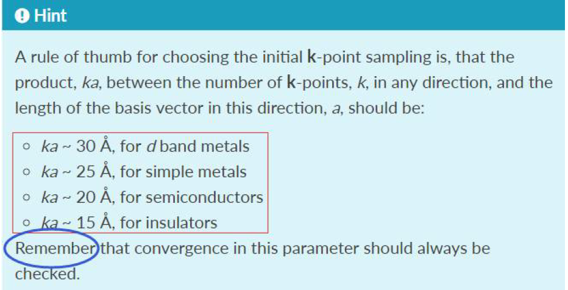
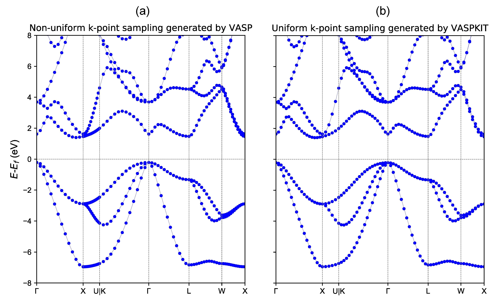
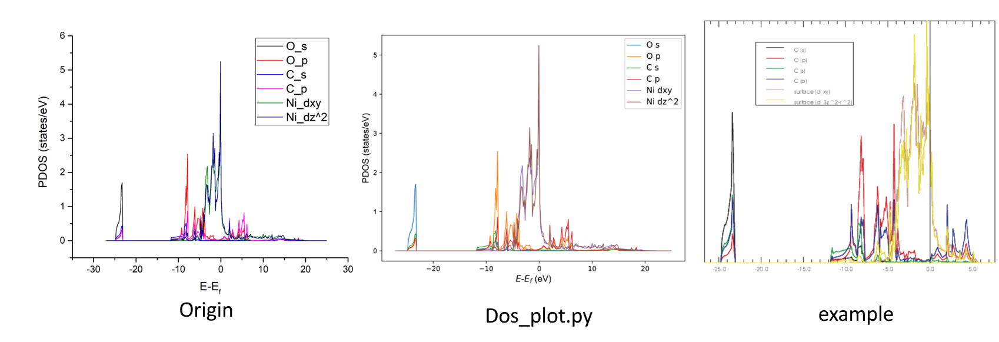
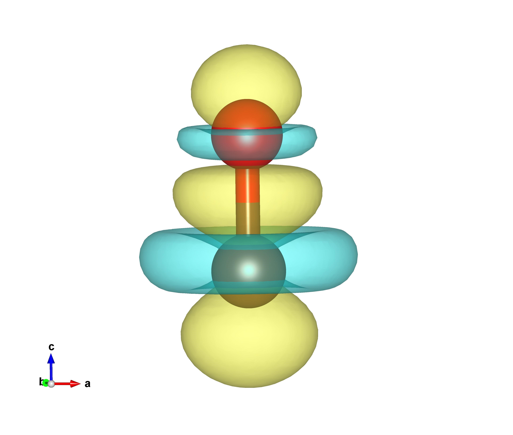
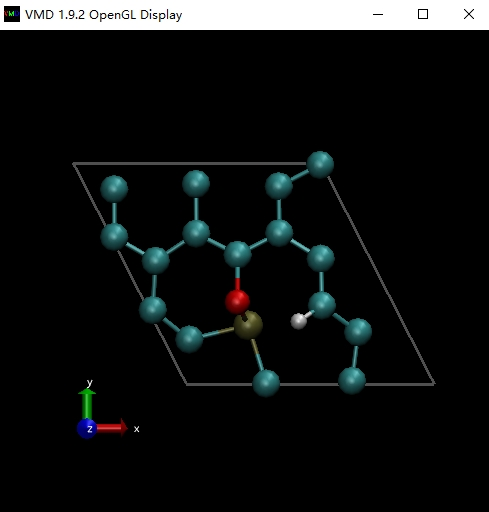
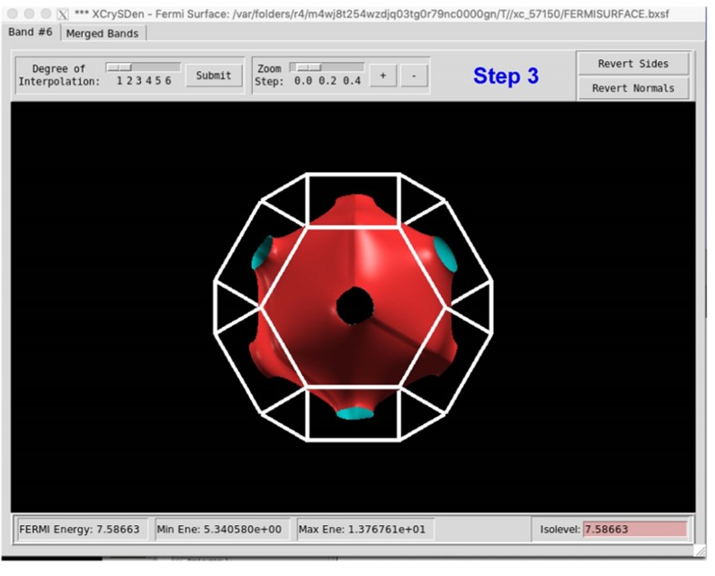
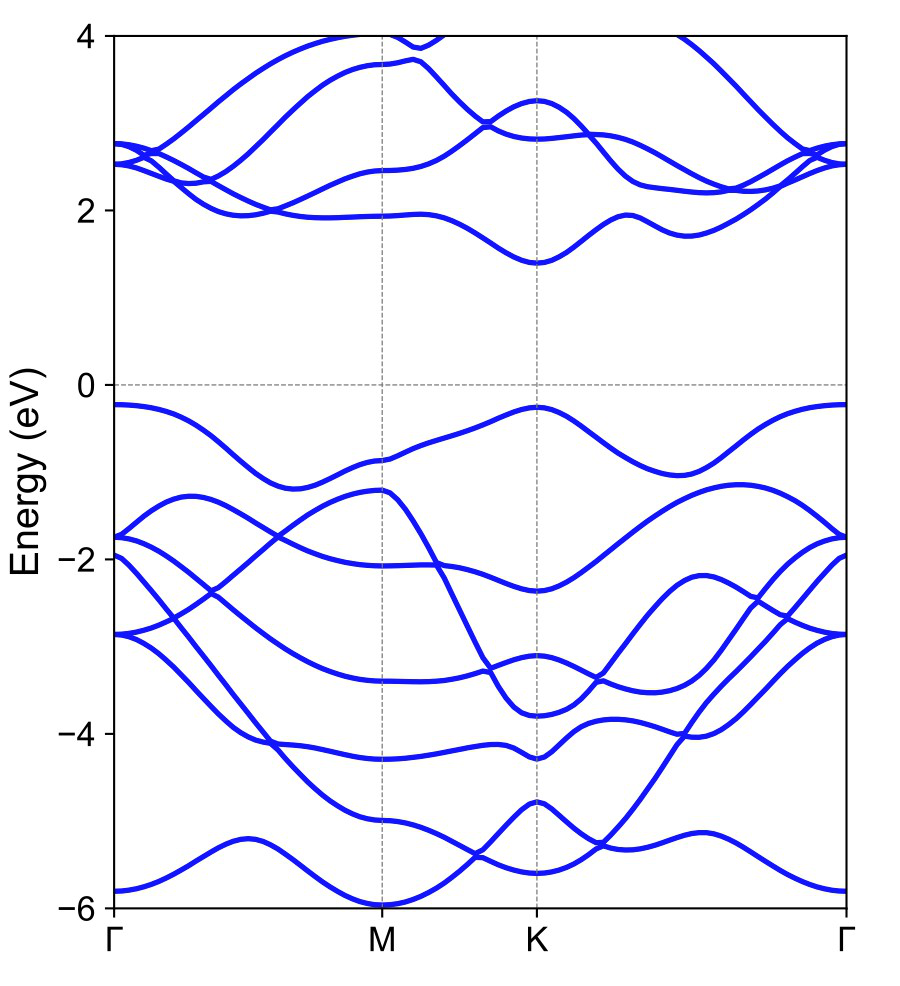
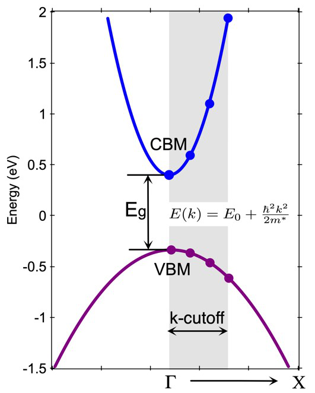
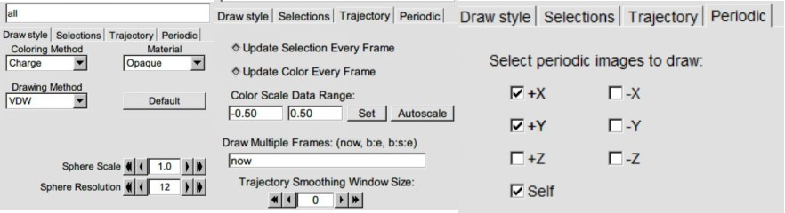
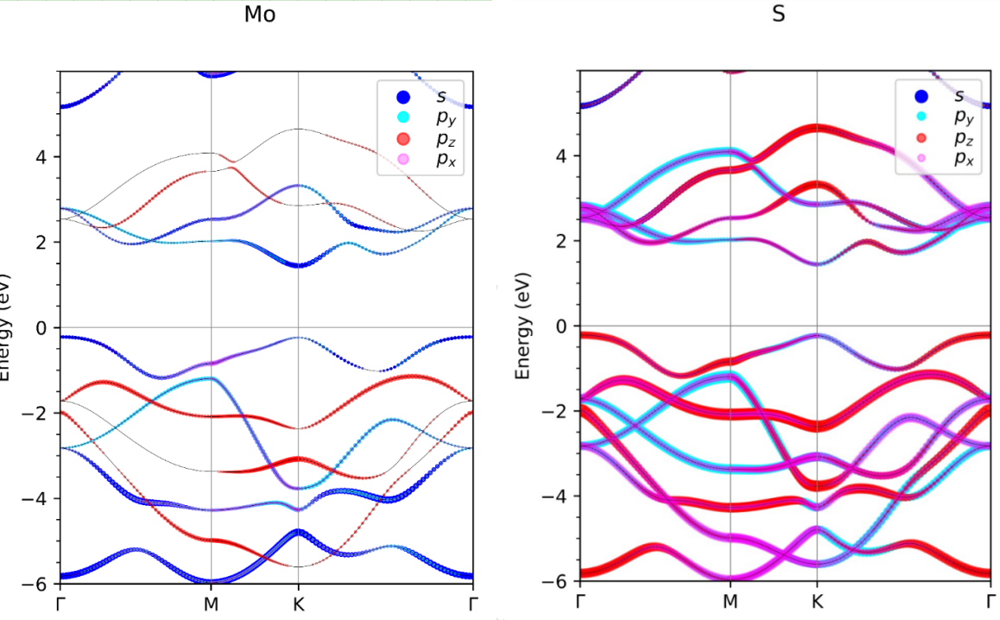

## VASPKIT---VASP软件预-后处理工具介绍 

---
[TOC]
### 1. VASPKIT简介
`VASP`的全称`Vienna Ab-initio Simulation Package`，是维也纳大学Hafner小组开发的进行电子结构计算和量子力学-分子动力学模拟软件包。它是目前材料模拟和计算物质科学研究中最流行的商用软件之一。与Material Studio软件包中的`CASTEP`功能类似，但是`VASP`的精度相对要高一点。不同于`CASTEP`的图形界面，`VASP`是一套没有图形界面的计算软件，建模、可视化、数据分析都需要依赖第三方工具如 P4VASP、ASE、Pymatgen、VESTA 软件等。VESTA、P4VASP 主要是用来建模、可视化和分析部分数据。而 ASE、Pymatgen 这些软件擅长于数据处理，但是安装比较麻烦，同时入门门槛比较高，需要使用者有一定的编程水平。`VASP`用户的学科分布很广，有做催化的，有做光学的，有做材料的，各个领域的数据后处理方式大相径庭。很多用户开发并贡献了自己所在领域用到的的脚本或者小程序，本人就开发了一款用来处理结构文件的`POSCARtookit`脚本。但是对于新用户来说，找到并成功使用这些脚本是不太容易的。因此一款容易上手、功能强大的预-后数据处理软件`vaspkit`应运而生。
最新版的`vaspkit`是王伟老师、[许楠](https://github.com/tamaswells)、刘锦程，[唐刚](https://github.com/obaica)，[李强](https://github.com/bigbrosci)和[乐平](https://github.com/LePingKYXK)共同努力的成果。`vaspkit 0.72`版本相对于之前的版本做了很多菜单调整，将功能相似的进行了归类，优化了一些已有功能，并增加了一些与催化有关的功能。`VASPKIT release` 版本是一款用`FORTRAN`编写，在`LINUX`环境下运行的二进制软件。它几乎不依赖于其他库，软件体积仅仅5.0M，无需安装即可使用，同时`EXAMPLES`目录下面有主要功能的测试例子，方便用户学习使用。

**主要功能有**：

1. 自动生成 VASP 计算所需的必备文件，包括 INCAR、POTCAR、POSCAR 等，并对其进行格式检查
2. 结构对称性查找
3. 催化方面的工具，根据层数或者高度区间固定原子，NEB 路径生成、NEB 路径生成可视化的 PDB 文件、虚频校正等
4. 生成晶体的能带路径（包括杂化泛函），并处理能带数据
5. 处理态密度 DOS 和投影态密度 PDOS
6. 处理电荷密度、静电势，绘制是空间波函数
7. 其他功能，比如热力学量校正（吸附质分子和气相分子），光学、分子动力学、导电率和半导体方面的小工具。

>**详细可见附录：VASPKIT菜单功能介绍**

**0.73版本新增功能和修复的BUGs **

-  Added support to determine independent elastic stiffness tensor by polynomial fitting of the energies vs strain relationships for bulk materials (task 201, except triclinic crystal system). 
-  Added support to read elastic stiffness tensor from OUTCAR file and calculate various mechanical properties for polycrystalline bulk materials (task 203). 
-  Added support to find conventional cell (task 603);
-  Added support to redefine lattice (task 400);
-  Added support to swap the axis of lattice vector (task 407);
-  Added support to Bader2PQR module contributed by J.C.LIU@THU (task 508);
-  Added support to convert cif files with no fractional occupations to POSCAR (task 105);
-  Added support to generate BAND_GAP file when extracted band structure data (tasks 211 and 252);
-  Added support to print out the average d band center in both spin up and spin down channels within the specified energy interval for each atom (task 503);
-  Added the parameter PLOT_MATPLOTLIB in ~/.vaspkit file to control whether the band-structure and DOS plots will be written; For more details see vaspkit/how_to_set_environment_variable file for reference;
-  Added the parameter USER_DEFINED_INCAR in ~/.vaspkit file to control whether to use embedded INCAR templates or user defined INCAR templates, need to set VASPKIT_UTILITIES_PATH variable first; For more details see vaspkit/how_to_set_environment_variable file for reference;
-  Added support to generate SELECTED_ATOM_LIST file when sum over PDOS (task 114) and PBAND (tasks 214 and 255) for selected atoms;
-  Fixed a bug in extracting projected density-of-states in non-collinear calculations pointed by G.Tang@BIU and other users;
-  Fixed a bug in generating K-Path for rectangular 2D-Bravais lattice pointed by X.U.LIU@GZU;
-  Fixed a bug in generating the KPOINTS file for band-unfolding calculations pointed by T.J.SHAO@WIPM;
-  Fixed a bug in evaluating the band gap values for spin-polarized systems when set the parameter SET_FERMI_ENERGY_ZERO to .TRUE. in the ~/.vaspkit file;
-  Minor bug fixes and significant optimizations.


### 2. VASPKIT的配置和使用
`vaspkit`是一款运行在LINUX环境下的软件，为了确保能够使用`vaspkit`的完整功能。用户可以配置`vaspkit`的环境目录，在下一次运行时生效。通过在`bash`终端下运行以下命令将环境变量文件复制到用户目录下。
```bash
cp -f how_to_set_environment_variable ~/.vaspkit
```
并编辑`.vaspkit`文件
```bash
vi ~/.vaspkit
```
该配置文件主要用来设置`vaspkit`的环境变量,包括VASP版本信息，赝势库的目录，泛函方法的选择，并选择是否按照VASP官方的推荐生成元素的赝势文件，设置生成的INCAR模板是覆盖、追加还是备份原有的INCAR。
```
# cp how_to_set_environment_variable ~/.vaspkit and modify the ~/.vaspkit file based on your settings!    
VASP5                    .TRUE.             # .TRUE. or .FALSE.; Set .FALSE. if using vasp.4.x 
GGA_PATH                 '~/POTCAR/GGA'     #  Path of GGA potential. 
PBE_PATH                 '~/POTCAR/PBE'     #  Path of PBE potential. 
LDA_PATH                 '~/POTCAR/LDA'     #  Path of LDA potential. 
POTCAR_TYPE               PBE               #  PBE, GGA or LDA; 
GW_POTCAR                .FALSE.            # .TRUE. or .FALSE.;
RECOMMENDED_POTCAR       .TRUE.             # .TRUE. or .FALSE.; 
MINI_INCAR               .FALSE.            # .TRUE. or .FALSE.; 
SET_FERMI_ENERGY_ZERO    .TRUE.             # .TRUE. or .FALSE.;  
SET_INCAR_WRITE_MODE     OVERRIDE           #  OVERRIDE, APPEND,BACK-UP-OLD,BACK-UP-NEW; 
```
设置好你本地的赝势库 POTCAR 目录，以及完成一些其他的设置后，就可以启动`vaspkit`了。
为了方便，可以将`vaspkit`的绝对路径加入到环境变量里，如果是 LINUX 的用户，可以这样操作：
```bash
echo 'export PATH=/home/vaspkit.0.73/bin/:$PATH' >> ~/.bashrc
source ~/.bashrc
```
其中`/home/vaspkit.0.73/bin/`需要将用户自己的`vaspkit`可执行文件所在`bin`目录的绝对路径替代。

> `vaspkit`自`0.73`版之后**提供了自动配置脚本**`setup.sh`。执行`source setup.sh` 或者`bash setup.sh`即可以完成配置。对于新用户来说非常友好，但是赝势库目录还需自己设置。如果已经存在`~/.vaspkit`，上述操作不会覆盖它，仍使用老版本的环境变量。

完成上述设置后，在终端直接输入`vaspkit`或者`/home/vaspkit.0.73/bin/vaspkit`即可开始运行`vaspkit`程序。不出意外，您将会看到一个与下面所展示一致的，非常萌的界面：

```
            \\\///
           / _  _ \       Hey, you must know what you are doing.
         (| (.)(.) |)     Otherwise you might get wrong results!
 +-----.OOOo--()--oOOO.------------------------------------------+
 |       A Pre- and Post-Processing Program for VASP Code        |
 |           VASPKIT Version: 0.73 (18 Apr. 2019)                |
 |            Developed by Vei WANG (wangvei@me.com)             |
 |            Contributor: Nan XU (tamas@zju.edu.cn)             |
 +-----.oooO-----------------------------------------------------+
        (   )   Oooo.
         \ (    (   )
          \_)    ) /
                (_/
 ===================== Structural Options ========================
 1)  VASP Input Files Generator    2)  Elastic-Properties
 3)  K-Path Generator              4)  Structure Editor
 5)  Catalysis-ElectroChemi Kit    6)  Symmetry Search

 ===================== Electronic Options ========================
 11) Density-of-States             21) DFT Band-Structure
 23) 3D Band-Structure             25) Hybrid-DFT Band-Structure
 26) Fermi-Surface                 28) Band-Structure Unfolding

 =========== Charge & Potential & Wavefunction Options ===========
 31) Charge & Spin Density         42) Potential-Related
 51) Wave-Function Analysis
 ====================== Misc Utilities ===========================
 71) Linear Optics                 72) Molecular-Dynamics Kit
 73) VASP2BoltzTraP Interface
 91) Semiconductor Calculator      92) 2D-Materials Kit

 0)  Quit
 ------------>>
```
如果出现以下问题,说明您的 LINUX 运行依赖库版本太低，需要升级（不建议），可以联系开发者获得在低版本 LINUX 环境下编译的版本。
```bash
vaspkit: /lib64/libc.so.6: version `GLIBC_2.14' not found (required by vaspkit)
```
如果出现`-bash: line 7: ./vaspkit: Permission denied`权限问题，只需赋予`vaspkit`执行权限即可：
```bash
chmod u+x /home/vaspkit.0.73/bin/vaspkit
```


### 3. VASPKIT的子功能介绍
本教程将介绍使用`vaspkit`生成VASP的输入文件，使用PBE和HSE06计算能带，提取分析分波态密度和局域态密度，校正热力学量计算自由能、生成差分电荷密度, 催化相关的工具和能带反折叠计算。能带计算包含了使用普通泛函和杂化泛函两个例子，而热力学量校正主要计算零点振动能及温度对自由能和焓的贡献。

#### 3.1 VASP输入文件的生成和检查
为了成功运行VASP计算任务，我们至少需要4个文件：INCAR、POSCAR、POTCAR 及 KPOINTS。INCAR 文件是告诉 VASP 算什么任务、怎么算的控制文件；POSCAR是包含晶格信息、原子坐标信息和原子速度信息（MD用）的文件；POTCAR是赝势文件，也就是将内层电子用势函数表示；KPOINTS（可包含在INCAR内，不推荐省略）包含了倒易空间内 K点信息，波函数会在这些点上积分得到电荷密度。
`vaspkit 0.71`以后的版本将K点生成、POTCAR生成和INCAR生成整合到了功能`1`：`VASP Input Files Generator`中。
```
 101) Customize INCAR File
 102) Generate KPOINTS File for SCF Calculation
 103) Generate POTCAR File with Default Setting
 104) Generate POTCAR File with User Specified Potential
 105) Generate POSCAR File from cif (no fractional occupations)
 106) Generate POSCAR File from Material Studio xsd (retain fixes)
 107) Reformat POSCAR File in Specified Order of Elements
 108) Successive Procedure to Generate VASP Files and Check
 109) Check All VASP Files
```
下面我们将展示怎么使用`vaspkit`进行一个 VASP 计算任务。
`POSCAR`一般由软件生成或者从数据库中获得，简单体系可自己搭建。本例中从数据库 <http://www.catalysthub.net/> 中获得**纤锌矿ZnO**的POSCAR文件（也可以下载CIF文件，然后通过`vaspkit`的功能`105`或者`VESTA`转化成POSCAR文件，只是原子位置分数占据的问题需要注意）。在`catalysthub`中检索`ZnO`，检索结果如下所示。纤锌矿ZnO的为六方晶系，空间群为`P63mc`。因此下载第二行的POSCAR，下载的文件名为`ZnO-1811117.vasp`。置于`vaspkit.0.73/examples/ZnO_optimization`目录下。

```
The following shows the results (4) for: ZnO

Full formula	Space group	HM	HALL	Lattice system	Band gap	Structure file	
Zn1O1	216	F-43m	F -4 2 3	Cubic	0.63110 eV	CIF | POSCAR | LAMMPS	
Zn2O2	186	P63mc	P 6c -2c	Hexagonal	0.73170 eV	CIF | POSCAR | LAMMPS	
Zn1O1	225	Fm-3m	-F 4 2 3	Cubic	0.71940 eV	CIF | POSCAR | LAMMPS	
Zn1O1	221	Pm-3m	-P 4 2 3	Cubic	0.00000 eV	CIF | POSCAR | LAMMPS	

```
接下来进行晶格优化得到合理的结构。将其改名为 POSCAR 文件。
```bash
cp -f ZnO-1811117.vasp POSCAR
```
> Material Studio是常用的构建模型和可视化结构的软件，MS中的结构亦可借助其它工具转换成`POSCAR`。目前常用的做法是在MS中导出`cif`文件，再通过功能`105`或者`vesta`转换成`POSCAR`。但是转换颇为麻烦并且会丢失原子的位置限制信息。因此赵焱老师开发了固定原子坐标perl小脚本[xsd2pos.pl](https://mp.weixin.qq.com/s/F82Hzh4saiOpp4xLFU_HGg)，可以在MS中运行`perl`脚本将结构生成`POSCAR`,链接里有详细的操作流程，这里不再赘述。`vaspkit`开发者也开发了一款类似的后处理脚本，能够将含有位置固定信息的`xsd`批量转换成·`POSCAR`，并将此脚本集成到了`vaspkit`的`106`功能中。`xsd`中可以包含`Fix Fractional Position`或者`Fix Cartesian Position`两种限制方式。

我们采用`vaspkit`预设的INCAR`组合`生成所需的INCAR文件。在有POSCAR的目录下运行`vaspkit`,输入`1`选择功能`VASP Input Files Generator`，然后输入`101`选择`Customize INCAR File`，会得到以下的显示信息：

```
 +-------------------------- Warm Tips --------------------------+
                You MUST Know What You Are Doing
  Some Parameters in INCAR File Neet To Be Set/Adjusted Manually
 +---------------------------------------------------------------+
 ======================== INCAR Options ==========================
 ST) Static-Calculation            SR) Standard Relaxation
 MG) Magnetic Properties           SO) Spin-Orbit Coupling
 D3) DFT-D3 no-damping Correction  H6) HSE06 Calculation
 PU) DFT+U Calculation             MD) Molecular Dynamics
 GW) GW0 Calculation               BS) BSE Calculation
 DC) Elastic Constant              EL) ELF Calculation
 BD) Bader Charge Analysis         OP) Optical Properties
 EC) Static Dielectric Constant    PC) Decomposed Charge Density
 FD) Phonon-Finite-Displacement    DT) Phonon-DFPT
 NE) Nudged Elastic Band (NEB)     DM) The Dimer Method
 FQ) Frequence Calculations        LR) Lattice Relaxation

 0)   Quit
 9)   Back
 ------------>>
 Input Key-Parameters (STH6D2 means HSE06-D2 Static-Calcualtion)
 LR
```
输入`LR`，就会得到一个预设好的用于做晶格弛豫任务的INCAR（***有些模板需要手动修改。比如 DFT+U 的 U值设定，NEB 的 IMAGES数目等***）。如果已经有INCAR文件，则原来的INCAR文件会被覆盖。你可以编辑`~/.vaspkit`更改INCAR的输出设置。只需将最后一行的`SET_INCAR_WRITE_MODE`由默认的`OVERRIDE`更改为 `APPEND,BACK-UP-OLD,BACK-UP-NEW`中的一个，分别对应于新的内容增加到原有的INCAR后面，备份原有的INCAR再写入新的INCAR和写入到新的INCAR.new里面。
接下来生成KPOINTS文件。对于非能带计算，只需用程序自动撒点的方式，但是需要用户选择撒点方式和K点密度。具体内容可以参考李强的教程`Learn VASP The Hard Way （Ex1）: VASP基本输入文件的准备`。启动`vaspkit`,输入`1`选择功能`VASP Input Files Generator`，然后输入`102`选择功能`Generate KPOINTS File for SCF Calculation`，接下来输入`2`选择`Gamma Scheme`撒点方式（稳妥的选择），会得到以下的显示信息：

```
-->> (1) Reading Lattices & Atomic-Positions from POSCAR File...
 +-------------------------- Warm Tips --------------------------+
   * Accuracy Levels: (1) Low: 0.06~0.04;
                      (2) Medium: 0.04~0.03;
                      (3) Fine: 0.02-0.01.
                      (4) Gamma-Only: 0.
   * 0.04 is Generally Precise Enough!
 +---------------------------------------------------------------+
 Input KP-Resolved Value (unit: 2*PI/Angstrom):
 ------------>>
```
根据提示`0.04`已经足够精确了，因此输入`0.04`，将会得在当前目录下得到KPOINTS和POTCAR(自动生成)文件。
```
 -->> (2) Written KPOINTS File!
 -->> (3) Written POTCAR File with the Recommended Potential!
```
KPOINTS内容如下：
```
K-Mesh Generated with KP-Resolved Value : 0.040
0
Gamma
   9   9   5
0.0  0.0  0.0
```
`Learn VASP The Hard Way Ex19 谁偷走的我的机时？（三）`提到了一个简单的K点数目判断准则，对于半导体k点数目乘实空间对应晶矢量大于20Å（参考下图），本例中ka=29.62Å已经符合经验规律。刘锦程提到对于非正交体系 ，倒格矢长度和晶常数不满足反比关系，所以采用ka≈kb≈kc的经验准则并不能保证 K点密度在各个方向长相等。而`vaspkit`严格计算了倒空间晶格矢量比例，**选用经验“步长”（倒空间长度除以K点数目）0.03~0.04**，`vaspkit`就能根据所选的K点密度自动生成各个方向的K点数，此时倒空间K点的**resolution** 为$2\pi\cdot0.04  \AA^{-1}$.



生成KPOINTS的同时，**会根据POSCAR中的元素类型从赝势库中提取并组合生成POTCAR**，前提是你在`~/.vaspkit`里正确设置了`PBE_PATH`的路径，并根据`POTCAR_TYPE`选择是生成GGA-PW91、LDA还是PBE的赝势。值得注意的是提示信息`Written POTCAR File with the Recommended Potential!`，意味着`vaspkit`根据[VASP官网的推荐](http://cms.mpi.univie.ac.at/vasp/vasp/Recommended_PAW_potentials_DFT_calculations_using_vasp_5_2.html) 从PBE的赝势库中选择赝势。
PBE的赝势分为几种，无后缀、`_pv,_sv,_d` 和数字后缀，`_pv,_sv,_d` 就是说`semi-core`的`p,s`或者`d`也当做价态处理了。因为有些情况下，次外层电子也参与了成键。刘锦程提到进行`Bader`电荷分析，需要采用带`_pv,_sv`的赝势。特别地，官网提到`Important Note: If dimers with short bonds are present in the compound (O2 , CO, N2 , F2 , P2 , S2 , Cl2 ), we recommend to use the _h potentials. Specifically, C_h, O_h, N_h, F_h, P_h, S_h, Cl_h.`常用的做法是：用两种赝势测试一下对自己所关心的问题的影响情况。在影响不大的情况下，选用不含后缀的赝势，毕竟包含更多的价电子，截断能上升很多，计算量明显增大。

>如果需要手动生成POTCAR，可以通过功能`104`**手动选择每个元素的赝势类型**。本例中演示给Zn选择`Zn_pv`的`PBE`赝势。选择功能`104`，依次输入需要设定的赝势类型`O`和`Zn_pv`，如果设定的赝势目录下没有你选择的赝势类型，将会提示你重新输入。
```
 -->> (1) Reading Structural Parameters from POSCAR File...
 Auto detected POTCAR_TYPE is O, please type the one you want!
O
 Auto detected POTCAR_TYPE is Zn, please type the one you want!
Zn_pv
 -->> (2) Written POTCAR File with user specified Potential!
```
通过命令`grep TIT POTCAR`可以看到POTCAR中的赝势为`O`和`Zn_pv`，满足我们的需求。
为了取得有意义的结果，需要满足INCAR中的ENCUT大于POTCAR中的所有元素的ENMAX。通过以下命令可以查看所有元素的ENMAX：
```bash
grep ENMAX POTCAR
```
可以看到默认的INCAR参数中`ENCUT=400eV `被注释掉了，但是保留了`PREC   =  Normal`，程序会自动将`ENCUT`设为`max(ENMAX)`。当然也可以自行设置`ENCUT`参数，只要参数大于所有元素的`ENMAX`，这时候以自己设定的`ENCUT`参数为准。注意在优化晶胞常数时，需要用较高的`ENCUT`（`Learn VASP The Hard Way （Ex36）：直接优化晶格常数`），因此`LR`任务（优化晶格常数）模板生成的INCAR中默认设置了`PREC=High`，VASP程序会自动将`ENCUT`设为`max(ENMAX)*1.3`。乐平老师提到，为了确保相同体系的`ENCUT`一致，VASP最新的官方手册已经不推荐使用`PREC=High`了，它推荐设置为`PREC=Accurate`并手动设置`ENCUT`的值。
提交VASP计算任务，可以发现任务很快就失败了。错误日志如下：
```
 running on   16 total cores
 distrk:  each k-point on   16 cores,    1 groups
 distr:  one band on    1 cores,   16 groups
 using from now: INCAR     
 vasp.5.4.4.18Apr17-6-g9f103f2a35 (build Apr 07 2018 02:38:49) complex          
  
 POSCAR found type information on POSCAR  O 
 ERROR: the type information is not consistent with the number of types
```
>通过分析发现，VASP只读出了`O`的元素和赝势，*Zn*没有从POSCAR中读出，因此报错。原因在于，从数据库下载的POSCAR中空格的分隔符是制表符`\t`，VASP不能正确读出以`\t`为分隔符的字符串。同样的问题也会在INCAR中出现。另外在WINDOWS系统下生成的POSCAR或INCAR在VASP中可能会出现非常奇怪的错误。最致命的是VASP**不会自动检查POSCAR中的元素类型是否与POTCAR元素类型是否一致**，也就是你算石墨烯也可以用H的赝势，并不会报错，但是结果一定是错的！因此`vaspkit 0.71`以后的版本加入了格式纠正和赝势元素检查的功能`109`。
输入`109`,`vaspkit`会自动进行INCAR和POSCAR的格式纠正，并检查赝势元素是否一致。
```
 -->> (1) Reading Structural Parameters from POSCAR File...
 All Files Needed Exist.
 Element type in POSCAR may be not corresponding to POTCAR
 POTCAR:Zn_pv
 POSCAR:Zn
```
执行检查之后，再次提交任务。此时任务已经能正确运行。
>为了方便用户，在乐平老师的建议下，我们设置了功能`108`：`Successive procedure to generate VASP files and check`。先设置INCAR，再设置K点密度，生成KPOINTS和POTCAR，最后再调用功能`109`自动检查所有的文件是否存在问题。我们的目标是，**VASP之前，先KIT一下**。


#### 3.2 能带计算
 能带计算的KPOINTS与普通计算的KPOINTS不一样，通常需要第一布里渊区内的一条或几条高对称点路径来计算能带性质。  传统的做法是通过[SeeK-Path网站](https://www.materialscloud.org/tools/seekpath/)或者Material Studio软件获得晶体倒易空间第一布里渊区内的高对称点，再通过脚本插值生成高对称点路径上的K点，得到满足要求的KPOINTS。好消息是新版的`vaspkit`集成了与SeeK-path一致的算法分析晶体的高对称点，可以方便地生成PBE泛函和HSE06杂化泛函所需的KPOINTS，**目前不支持三斜晶系**。
在`vaspkit.0.73/examples/hybrid_DFT_band`目录下有一个使用HSE06杂化泛函计算磷化镓的能带结构的例子。同样也可以使用PBE泛函计算该磷化镓结构的能带，只是普通的PBE泛函会低估带隙。为了计算能带，首先得获得晶体的第一布里渊区内的一条或几条高对称点路径。在有POSCAR的目录下运行`vaspkit`,输入`3`选择功能`Band-Path Generator`，在下一个界面输入`303`选择`3D bulk structure (Experimental)`，你会得到以下信息：

```
 +-------------------------- Warm Tips --------------------------+
         See An Example in vaspkit/examples/seek_kpath.
 This Feature Is Experimental & Check Your System using SeeK-Path.
 For More details See [www.materialscloud.org/work/tools/seekpath].
 +---------------------------------------------------------------+
 -->> (1) Reading Structural Parameters from POSCAR File...
 +-------------------------- Summary ----------------------------+
                           Prototype: AB
           Total Atoms in Input Cell:   2
     Lattice Constants in Input Cell:   3.854   3.854   3.854
        Lattice Angles in Input Cell:  60.000  60.000  60.000
       Total Atoms in Primitive Cell:   2
 Lattice Constants in Primitive Cell:   3.854   3.854   3.854
    Lattice Angles in Primitive Cell:  60.000  60.000  60.000
                      Crystal System: Cubic
                       Crystal Class: -43m
                     Bravais Lattice: cF
            Extended Bravais Lattice: cF2
                         Space Group: 216
                         Point Group: 31 [ Td ]
                       International: F-43m
                 Symmetry Operations:  24
                    Suggested K-Path: (shown in the next line)
 [ GAMMA-X-U|K-GAMMA-L-W-X ]
 +---------------------------------------------------------------+
 -->> (2) Written PRIMCELL.vasp file.
 -->> (3) Written KPATH.in File for Band-Structure Calculation.
 -->> (4) Written HIGH_SYMMETRY_POINTS File for Reference.
 -->> (5) Written POTCAR File with the Recommended Potential!
 +---------------------------------------------------------------+
 |                         * DISCLAIMER *                        |
 |        CHECK Your Results for Consistency if Necessary        |
 |   Bug Reports and Suggestions for Improvements Are Welcome    |
 | Citation of VASPKIT Is Not Mandatory BUT Would Be Appreciated |
 |                     (^.^) GOOD LUCK (^.^)                     |
 +---------------------------------------------------------------+
```
`vaspkit`会分析晶体的对称性并得到两条建议的能带路径`[ GAMMA-X-U|K-GAMMA-L-W-X ]`，同时生成了晶体的单胞结构`PRIMCELL.vasp`，并生成了`KPATH.in`用于能带结构计算。`KPATH.in`的第二行数字表示了每小段路径中插值的K点的数目，***如果默认的数值都算不动的话，可以考虑将其设小***。能带路径只针对于primitive cell，因此需要执行下面的命令，用生成的primitive cell作为计算的结构文件。
```bash
cp -f PRIMCELL.vasp POSCAR
```
下图展示的是磷化镓的primitive cell和其第一布里渊区的高对称点位置，由SeeK-path网站生成。

##### PBE泛函计算能带
PBE泛函计算能带分为两步，第一步使用普通K点网格（功能102）进行自洽计算 ，启动`vaspkit`,输入`1`选择`VASP Input Files Generator`，再选择`108`选择`Successive Procedure to Generate VASP Files and Check`功能，输入`ST`,生成静态自洽的INCAR，并按照提示生成自洽用的K点。本例中`ISMEAR=0`，即`Gaussian Smearing`方法，如果是金属体系可以选择换成`ISMEAR=1`。接着调用VASP计算。第二步：***使用 KPATH.in 里的高对称点信息作为新的 KPOINTS，然后读入电荷 CHGCAR***进行能带非自洽计算，即：
```bash
cp -f KPATH.in KPOINTS
echo "ICHARG=11" >> INCAR
```
也就是读入上一步生成的CHGCAR并保持不变，调用VASP计算。
待第二步完成后，通过功能`21`从能量本征值文件中读入能带结构。**值得一提的是，费米能级应该以自洽计算的为准**，因此如果想获得准确的费米能级，可以在第一步运行之后执行以下命令提取自洽后DOSCAR中的费米能级给第二步处理能带数据用:
```bash
echo -e "\n" $(sed -n 6p DOSCAR | awk '{print $4}') > FERMI_LEVEL.in
```


#####  HSE06杂化泛函计算能带
杂化泛函相比于 PBE 泛函和 DFT+U 方法，在计算带隙方面很有优势，但是HSE06的杂化泛函需要 KPOINTS里既有权重不为 0的 K点进行自洽计算，又要求有权重为 0的高对称点计算能带性质。因此操作流程颇为繁琐。
重启`vaspkit`，输入`25`选择功能`Hybrid-DFT Band-Structure`，在下一个界面输入`251`选择`Generate KPOINTS File for Hybrid Band-Structure Calculation`。再输入`1`选择`Monkhorst-Pack Scheme`用MP方法生成自洽用的K点网格并根据建议输入`0.04`选择较密的K点密度（权重不为 0的 K点用于自恰计算），**接下来还需手动指定能带路径上K点的密度，用于能带计算**，再次输入`0.04`，即可生成HSE06杂化泛函所需的 KPOINTS。0.72以前的版本在不同的能带路径上取相同的K点数，从而导致在不同路径上的K分布并不均匀，如下 图a 所示。`VASPKIT`最新版支持根据给定k点间隔**自动确定不同能带路径上的K点数**，从而保证在整个能带计算中**均匀撒点**，如下图b所示。

```bash
 ======================= K-Mesh Scheme ==========================
 1) Monkhorst-Pack Scheme                            
 2) Gamma Scheme                                     
                                                     
 0)   Quit                                             
 9)   Back                                             
 ------------->>
1
 +-------------------------- Warm Tips --------------------------+
 Input Resolution Value to Determine K-Mesh for SCF Calculation: 
 (Typical Value: 0.03-0.04 is Generally Precise Enough)
 ------------>>
0.03
 Input Resolution Value along K-Path for Band Calculation: 
 (Typical Value: 0.03 for DFT and 0.04 for hybrid DFT)
 ------------>>
0.04
```



可通过KPOINTS文件第一行查看产生K点产生信息。`Parameters to Generate KPOINTS (Don't Edit This Line):  0.040 0.040 24 126 6 28 10 30 24 20 14 `，第一个和第二个数据分别决定总能计算（权重不为零部分）和能带计算（权重为零部分）K点密度，也就是我们之前输入的数值，24表示总能计算部分在不可约布里渊区的K点数目，126表示能带计算中总K点数目，6表示共有6条能带路径，从第一到第六条能带上分别选取28, 10, 30, 24, 20和14个K点，共126个K点。**此均匀撒点的方式能够提高能带的计算效率**。但是**请注意：由于0.72当前及之后版本将采用新的杂化能带计算KPOINTS文件格式，不再兼容由VASPKIT早期产生的杂化能带数据提取。**

因为HSE06计算非常耗时，因此本例中采用两步法加速收敛，当然也可以跳过第一步直接用 HSE06 进行自洽。第一步：使用 PBE 泛函产生波函数和电子密度，第二步：***保持 KPOINTS不变，读入波函数*** 进行HSE06计算。
利用功能`Customize INCAR File`生成第一步PBE自洽需要的INCAR。重启`vaspkit`,输入`1`选择`VASP Input Files Generator`，再选择`101`选择`Customize INCAR File`功能，输入`ST`,生成静态自洽的INCAR。本例中`ISMEAR=0`，即`Gaussian Smearing`方法，如果是金属体系可以选择换成`ISMEAR=1`。调用VASP计算，待自洽完成后执行第二步 HSE06计算。重启`vaspkit`, 选择功能`101 Customize INCAR File`功能，输入`STH6`,生成HSE06计算所需要的INCAR。再次调用VASP计算后，就完成了HSE06的自洽计算。
接下来使用`vaspkit`提取能带数据，并输出高对称点在能带图中的坐标信息。输入`25`选择功能`Hybrid-DFT Band-Structure`，在下一个界面输入`252`选择`Read Band-Structure for Hybrid-DFT Calculation`处理能带数据。处理结果如下所示

```
 -->> (1) Reading Input Parameters From INCAR File...
 -->> (2) Reading Fermi-Level From DOSCAR File...
 -->> (3) Reading Energy-Levels From EIGENVAL File...
 -->> (4) Reading Lattices & Atomic-Positions from POSCAR File...
 -->> (5) Reading K-Paths From KPATH.in File...
 -->> (6) Written BAND.dat File!
 -->> (7) Written BAND-REFORMATTED.dat File!
 -->> (8) Written KLINES.dat File!
 -->> (9) Written KLABELS File!
```
`BAND-REFORMATTED.dat`是修改后生成的能带信息（**0.70版本生成的有问题，Band.dat正常！0.71以后的版本以后已修复。**），格式如下所示，第一列是K-PATH，相邻的距离为高对称点在倒空间的距离，第二列，第三列等即为所需的不同的能带线。如果开了自旋，第二列和第三列为能带1的spin up和spin down，以此类推。将dat文件拖入Origin软件后，即可得到能带图。

```
# Kpath    Energy-Level (in eV)
       0.00000     -14.54063      -0.82009      -0.82009 
       0.12809     -14.48597      -1.24459      -0.97903 
       0.25617     -14.32291      -2.13627      -1.37615 
       0.38426     -14.05442      -3.15793      -1.87258 
       0.51234     -13.68641      -4.20790      -2.37100 
       0.64043     -13.22973      -5.24586      -2.81765 
       0.76851     -12.70500      -6.23748      -3.18362 
       0.89660     -12.15541      -7.12954      -3.45312 
```
`KLABELS`是由读取能带标识的子模块生成的。通过读取`KPATH.in`（PBE能带计算时为KPOINTS）高对称点后标识，写入KLABELS文件。
`KPATH.in`文件内容如下：

```
Generated by VASPKIT based on Hinuma et al.'s Paper, Comp. Mat. Sci. 128, 140 (2017), DOI: 10.1016/j.commatsci.2016.10.015.
   10
Line-Mode
Reciprocal
   0.0000000000   0.0000000000   0.0000000000     GAMMA          
   0.5000000000   0.0000000000   0.5000000000     X              
 
   0.5000000000   0.0000000000   0.5000000000     X              
   0.6250000000   0.2500000000   0.6250000000     U              
 
   0.3750000000   0.3750000000   0.7500000000     K              
   0.0000000000   0.0000000000   0.0000000000     GAMMA          
 
   0.0000000000   0.0000000000   0.0000000000     GAMMA          
   0.5000000000   0.5000000000   0.5000000000     L              
 
   0.5000000000   0.5000000000   0.5000000000     L              
   0.5000000000   0.2500000000   0.7500000000     W              
 
   0.5000000000   0.2500000000   0.7500000000     W              
   0.5000000000   0.0000000000   0.5000000000     X   
```
`KLABELS`文件如下：
```
K-Label    K-Coordinate in band-structure plots 
GAMMA              0.000
X                  1.153
U|K                1.560
GAMMA              2.783
L                  3.781
W                  4.597
X                  5.173
* Give the label for each high symmetry point in KPOINTS (KPATH.in) file. Otherwise, they will be identified as 'Undefined' in KLABELS file
```
因为路径分了两条，所以能带图中第二个高对称点位置的标识为`U|K `。`K-Coordinate in band-structure plots `也就是每个高对称点在能带图中的横坐标位置。例如能带路径`W-L-Gamma`, `Gamma`的横坐标就是`|W-L|+|L-Gamma|`两条线段（在倒空间中的）长度的累加，以此类推。当出现第二条路径`X-W`，`Gamma|X`点的横坐标就是第一条路径末点`Gamma`的横坐标，而`W`点的横坐标为`Gamma|X`点的横坐标加上`|X-W|`的线段长度。
用户在Origin软件中处理了`BAND-REFORMATTED.dat`后，需要按照`KLABELS`文件中的位置在能带图中标识高对称点位置。

`vaspkit0.73`版本之后支持**自动绘制能带图和DOS图**，并能够进行自定义设置。当然如果要绘制出出版级的图片，需要自己对生成的Python绘图脚本进行设置。绘图需要用户安装了`Python解释器`，并安装`Numpy`和`Matplotlib`库。在`~/.vaspkit`环境变量中进行以下设置：

```bash
PYTHON_PATH              /usr/bin/python    #  Python exe containing numpy and matplotlib
PLOT_MATPLOTLIB          .TRUE.            #  Set it .TRUE. if you want to generate Graphs. (Matplotlib and Numpy packages MUST be embedded in Python)
```

在运行提取能带或者DOS时会自动进行绘图，选择`0`会自动根据预设的绘图设置进行绘图（下图的能带图即使用默认的设置绘的图），亦可选择`1`进行手动调整。

```bash
If you want use the default setting, type 0, if modity type 1
```

可以更改的选项有图片尺寸，图片分辨率，能量选择范围，线宽，字体，及颜色，字体大小等。

```bash
 ============================ change_plot_setup ========================
 1) Set if show a graph window or generate graphs silently
 2) Set Figure size
 3) Set Figure DPI
 4) Set energy ranges for DOS or Band
 5) Set if use the default line colors set or linewidth
 6) Set fontsize,font-family,fontcolor
```


 <div align="center"></div>

#### 3.3 分波态密度和局域态密度

> 原则上讲，[态密度可以作为能带结构的一个可视化结果](http://www.cailiaoniu.com/51344.html)。很多分析和能带的分析结果可以一一对应，很多术语也和能带分析相通。但是因为它更直观，因此在结果讨论中用得比能带分析更广泛一些。在电子能级为准连续分布的情况下，单位能量间隔内的电子态数目。即能量介于$E$~$$E+\Delta E$$之间的量子态数目$$\Delta Z$$与能量差$$\Delta E$$之比，即为态密度。能态密度与能带结构密切相关，是一个重要的基本函数。固体的许多特性，如电子比热、光和X射线的吸收和发射等，都与能态密度有关。在VASP中，`LORBIT=10`计算的就是LDOS，也就是每个原子的[局域态密度](http://blog.sciencenet.cn/blog-316926-493110.html) (local DOS)，是分解到每个原子上面的s,p,d；`LORBIT=11`，计算的就是PDOS,投影态密度(projected DOS)或分波态密度(partial DOS)，不仅分解到每个原子的s,p,d,而且还进行px,py,pz分解。

`vaspkit`最近优化了DOS的提取功能。参考了李强的脚本 。相对于`P4VASP`提取DOS信息，`vaspkit`有以下几个优点：①不需要将体积庞大的`vasprun.xml`拖回本地；②支持f轨道的提取，`P4VASP`提取f轨道时存在bug；③生成的`dat`文件格式友好，而`P4VASP`导出的`dat`是以空格为分隔符，无法直接用Origin绘图，并且没有DOS线的图例。

以官网的[CO在Ni表面的吸附模型](http://cms.mpi.univie.ac.at/wiki/index.php/Partial_DOS_of_CO_on_Ni_111_surface)和[Ni 100 surface](http://cms.mpi.univie.ac.at/wiki/index.php/Ni_100_surface_DOS)为例提取 PDOS。也可在大师兄群里(`217821116`)下载到`VASP Official Tutorials.pdf`

CO 吸附的例子中设置了`LORBIT=11`投影了轨道,关闭了自旋极化。

在`/vaspkit.0.73/examples/LDOS_PDOS/Partial_DOS_of_CO_on_Ni_111_surface`目录下启动`vaspkit`，输入命令`115`选择子功能`The Sum of Projected DOS for Selected Atoms and orbitals`。我们需要提取的是`O`的`s，p`轨道，`C`的`s，p`轨道以及表面的`dxy`和`d3z2-r2(dz2)`轨道。首先提示你选择元素（累加），第一次输入元素`O`，回车后提示你输入提取的轨道名（累加），第一次输入轨道`s`。回车后重复以上两个操作。如果想结束输入，在**元素选择行**直接按**回车键**结束输入。

```bash
 Input the Symbol and/or Number of Atoms to Sum [Total-atom: 7]
 (Free Format is OK, e.g., C Fe H 1-4 7 8 24),Press "Enter" if you want to end e
 ntry!

 ------------>>
O
 Input the Orbitals to Sum
 Which orbital? s py pz px dxy dyz dz2 dxz dx2 f-3 ~ f3, "all" for summing ALL.
s
```

本次的输入内容如下：

```bash
O - s - O - p - C - s - C - p - Ni - dxy - Ni - dz2 - 'Enter'
```

在目录下会生成一个`PDOS_USER.dat`，内容如下：

```bash
    #Energy        O_s        O_p        C_s        C_p     Ni_dxy    Ni_dz2
  -27.10266    0.00000    0.00000    0.00000    0.00000    0.00000    0.00000
  -26.92966    0.00000    0.00000    0.00000    0.00000    0.00000    0.00000
  -26.75566    0.00000    0.00000    0.00000    0.00000    0.00000    0.00000
  -26.58266    0.00000    0.00000    0.00000    0.00000    0.00000    0.00000
```

第一行是列名，也就是轨道的名称，2-301行为PDOS的数据点。拖入 `Origin` 可以得到 PDOS图，官网的图也放在下面供参考。在`~/.vaspkit`中打开绘图设置后，`vaspkit`会自动绘制`PDOS`图。VASP5.4.4`计算的O的s轨道的PDOS会比官网例子低一点，此现象已经用`P4VASP`验证无误。



元素行接受**自由格式**输入，你可以输入以下内容`1-3 4 Ni`表示选择元素1,2,3,4和Ni元素的PDOS进行累加。轨道行只支持标准输入，如果使用了`LORBIT=10`不投影轨道，你只能选择 `s p d f`中的一个或多个，如果使用了`LORBIT=11`投影了轨道，你可以从`s p d f`和`s py pz px dxy dyz dz2 dxz dx2 f-3 f-2 f-1 f0 f1 f2 f3`中选择一个或多个输入。轨道行还支持输入`all`计算所有轨道的DOS之和。

比如元素行输入`C O` ,对应的轨道选择`s px`，那么提取的就是所有C和O元素的`s`轨道和`px`轨道的PDOS之和。 `PDOS_USER.dat`中的轨道名 为` #Energy    C&O_s&px`，显而易懂。

接下来以纯的Ni表面为例。`vaspkit.0.73/examples/LDOS_PDOS/Ni_100_surface_DOS`

本例设置了`LORBIT=10`,开启了自旋极化。

本次的输入内容如下：

```bash
1 5 - all - 3 - all - 'Enter'
```

提取的是上下Ni表面的总态密度和中间`bulk`层的总态密度。

`PDOS_USER.dat`的内容如下：

```bash
     #Energy  up_1&5_all  dw_1&5_all    up_3_all    dw_3_all
   -10.54087     0.00000     0.00000     0.00000     0.00000
   -10.42787     0.00000     0.00000     0.00000     0.00000
   -10.31487     0.00000     0.00000     0.00000     0.00000
```

第二列为上下表面的`spin up`的总态密度，第三列为上下表面的`spin down`的总态密度。拖进`Origin`，可以轻松做出 DOS图。

 <div align="center"></div>

#### 3.4 热力学量校正

众所周知，`VASP`计算的是在体系在0K下的电子能量，没有考虑温度的贡献。做电化学模拟或者计算反应速率时需要计算自由能， 为了获得反应热需要计算焓， 为了获得0K下的体系内能要计算ZPE。`Learn VASP The Hard Way （Ex69） 表面吸附物种熵的计算`中讲述了气相分子和吸附质分子熵不同的计算方法,该系列教程可以在群`217821116`下载到PDF版本。刘锦程发布了两篇比较详细的自由能校正教程，包括[气体分子自由能](https://mp.weixin.qq.com/s/2nCcf1VXDfSti17127qvjA)和[吸附分子自由能](https://mp.weixin.qq.com/s/PYZs2ggrp4Jh6STZqr1hxg)，可以参考。
>对一个体系来说，焓、熵可以通过统计热力学计算分子的配分函数来获取：主要考虑理想气体的平动，转动，振动，电子贡献。对分子来说，举个例子，一个非线性的三原子分子，一共有3N个自由度。气相里面为：3个平动，3个转动以及3N-6个振动。但是当它吸附到表面上，由于平动和转动被限制住了，这6个自由度则会转化成振动自由度，也就是在表面上分子有3N个振动模式。如果你可视化表面上吸附分子频率计算的结果，会发现最后6个应的是平动和转动，但它们已经不是气相中的平动和转动了，我们称之为：frustrated translation，frustrated rotation。

#####  气相分子的热力学校正
李强的教程`Learn VASP The Hard Way （Ex68） 频率，零点能，吉布斯自由能的计算`提到VASP对于温度校正做的实在是太差了，他建议通过查询数据库（NIST等）的方法获得气相分子的热力学量。 而`Gaussian`对于分子和团簇的热力学校正功能比较完善。`Sobereva`开发了一个实用意义也有教学意义的`Shermo`程序（`http://sobereva.com/315`），通过分析高斯的输出结果，计算平动、转动、振动和电子贡献，得到给定温度、压力下体系的内能、焓、熵、自由能、热容。建议大家先看一下该程序的文档。`VASPKIT`将该程序集成进来，用户可以直接根据VASP的振动结果给出气相分子的内能、焓、熵、自由能校正。
下面以乙醇（/examples/thermo_correction/ethanol）为例对比VASP和Gaussian的热力学校正结果。
振动计算完成后，启动`VASPKIT`,输入`5`选择功能`Catalysis-ElectroChem Kit`，在下一个界面输入`502`选择`Thermal corrections for Gas`。紧接着提示输入温度`298.15K`、压力`1atm`和自旋多重度`1`。自旋多重度定义为2S+1，其中S是自旋角动量，它与体系内的单电子数(N)相关。S=N/2，所以说到底最简单的判断方法：自旋多重度等于单电子数+1。乙醇没有单电子，因此自旋多重度为1。（氧气的自旋多重度为3.）**该模块需要所有的原子都放开，也就是不能有原子被固定。**

```
 +-------------------------- Warm Tips --------------------------+
        This Feature Was Contributed by Nan XU, Sobereva.
   See An Example in vaspkit/examples/thermo_correction/ethanol.
 Vibrations ,Translation,Rotation,Electron contributions are considered.
 GAS molecules should not be with any fix.
 -->> (1) Reading Structural Parameters from CONTCAR File...
 -->> (2) Analyze Molecular symmetry information...
 Molecular symmetry is: Cs
 +---------------------------------------------------------------+
 Please input Temperature(K)!
298.15
 Please input Pressure(Atm)!
1
 Please input Spin multiplicity!--(Number of Unpaired electron + 1)
1
 ------------>>

```
`VASPKIT`会计算调用`Shermo`模块计算热力学贡献量。
```
 -->> (3) Extracting frequencies from OUTCAR...
 -->> (4) Reading OUTCAR File...
 -->> (5) Calculate Thermal Corrections...
 Zero-point energy E_ZPE   :      48.501 kcal/mol    2.103130 eV
 Thermal correction to U(T):      51.486 kcal/mol    2.232567 eV
 Thermal correction to H(T):      52.078 kcal/mol    2.258259 eV
 Thermal correction to G(T):      31.891 kcal/mol    1.382881 eV

 Thanks to Sobereva!(sobereva@sina.com)
```
而高斯`G09RevD.01`的计算结果为`U(T) 51.94 kcal/mol， H(T) 52.53  kcal/mol， G(T) 33.67 kcal/mol`，理论水平为`B3LYP/CC-pVDZ`，可以看到使用VASPKIT计算的分子热力学校正量已经接近Gaussian的计算结果。


#####     吸附质分子的热力学校正

对于吸附质分子，`Learn VASP The Hard Way （Ex69） 表面吸附物种熵的计算`建议忽略frustrated的平动和转动和电子贡献，只考虑3N-6的振动部分。本模块的原理正是基于此教程,由许楠、李强和刘锦程贡献。**注意：该模块不能计算气相分子的热力学贡献。**
以/vaspkit.0.73/examples/thermo_correction/ORR为例。下图展示的是在氧气在磷掺杂的石墨烯上的解离吸附的过渡态（Carbon, 2016, 105:214-223.），图片用VESTA软件可视化。为了求得温度的贡献，需要进行振动分析(`IBRION=5`),为了节省计算资源，只有P、O原子放开，而C原子固定住，在计算Energy Profile时，需要对其他体系做振动分析，保持放开的原子一致。**值得注意的是，本模块只考虑的振动的贡献，而电子的贡献忽略了，将波数小于50cm-1 的 frustrated translation，frustrated rotation的受限振动部分调节为50cm-1 的振动计入对熵的贡献。**
  <div align="center"></div>

启动`vaspkit`,输入`5`选择功能`Catalysis-ElectroChem Kit`，在下一个界面输入`501`选择`Thermal corrections for Adsorbate`。紧接着提示`Please Enter The Temperature (K):`，输入常温298.15K，屏幕会输出以下信息：

```
 +-------------------------- Warm Tips --------------------------+
 This Feature Was Contributed by Nan XU, Qiang LI and Jincheng LIU.
     See An Example in vaspkit/examples/thermo_correction/ORR.
 Only vibrations! No Translation & Rotation & Electron contribitions.
 +---------------------------------------------------------------+

 Please Enter The Temperature (K):

 ------------>>
298.15
 -->> (1) Reading OUTCAR File...
 +-------------------------- Summary ----------------------------+
 H = E_DFT + E_ZPE + E_H
 G = H - TS = E_DFT + E_ZPE + E_H - T*S

 Temperature (K): 298.1
 Entropy (eV/K):  0.0005
 Entropy contribution T*S (eV):  0.1541
 Enthalpy contribution E_H (eV):  0.0858
 Zero-point energy E_ZPE (eV):  0.1944
 Thermal correction to G(T) (eV):  0.1261
 Total energy at Zero K (eV) :   -159.3511
 Gibbs free energy at 298.1 K (eV) :   -159.2250
```
298.15K下体系的吉布斯自由能由以下公式给定：
>H = E_DFT + E_ZPE + E_H 
G = H - TS = E_DFT + E_ZPE + E_H - T*S    
E_DFT为体系在0K下的静态电子能量。本例中体系在298.15下的自由能为-159.2250 eV。要记住的是DFT计算中绝对能量没有意义，只有相对能量才make sense。

**需要指出的是，0.70版读取的Total energy at Zero K (eV)存在一个bug，0.71以后版本已修复。**


####  3.5 差分电荷密度图的绘制
差分电荷密度用来查看成键前后电荷的重新分布。这里以小木虫上的一个[CO差分电荷](http://muchong.com/html/201006/2129228.html)为例。
>文献中常用的差分电荷密度图为二次差分电荷密度图(difference charge density)，区别于差分电荷密度图(deformation charge density)。 差分电荷定义为成键后的电荷密度与对应的点的原子电荷密度之差。通过差分电荷密度的计算和分析，可以清楚地得到在成键和成键电子耦合过程中的电荷移动以及成键极化方向等性质。 “二次”是指同一个体系化学成分或者几何构型改变之后电荷的重新分布。
>Deformation charge density 的公式定义为 
>$$
>\Delta\rho=\rho_{AB_{sc}}-\rho_{AB_{atom}}
>$$
>Difference charge density的公式定义为 
>$$
>\Delta\rho=\rho_{AB}-\rho_{A}-\rho_{B}
>$$
>

计算Deformation charge density时，$$\rho_{AB_{sc}}$$可由自洽计算的CHG或CHGCAR得到,而$\rho_{AB_{atom}}$所需的 CHG 或 CHGCAR 可由下述非自洽计算得到:仍使用自洽计算的四个输入文件，但INCAR中需要设置`ICHARG=12 和 NELM=0`，[也就是CHGCAR是由孤立原子电荷的简单叠加构成](http://blog.sciencenet.cn/blog-567091-736154.html)。
而Difference charge density是文献中最常用的方法，需要对三个不同结构(A,B,AB)做自洽计算。步骤如下：

- 对优化后的结构做静态自洽计算
要注意的是，AB、A和B要分别放在同样大小的空间格子中并保证A和B与AB中相应坐标不变，**计算时也要保证三次自洽计算所采用的FFT mesh 一致（NGXF,NGYF,NGZF）**。
  ​     INCAR中几个注意的参数：
  ​       `IBRION = -1;NSW = 0;NGXF,NGYF,NGZF`
-  利用`vaspkit`对三个结构的CHGCAR做差
	​    根据公式$\Delta\rho=\rho_{CO}-\rho_{O}-\rho_{C}$，我们需要将CO的CHGCAR减去O的，再减去C的，就能得到想要的二次差分电荷密度。在父目录下启动`vaspkit`，输入`34`，选择功能`Charge & Spin Density`，进入电荷密度子菜单，再输入命令`314`选择` Charge-Density Difference`，在下一个界面提示输入`CO/CHGCAR C/CHGCAR O/CHGCAR`，会显示以下信息：
```
 ======================= File Options ============================
 Input the Names of Charge/Potential Files with Space:
 (Tip: To get AB-A-B, type: ~/AB/CHGCAR ./A/CHGCAR ../B/CHGCAR)

 ------------>>
CO/CHGCAR C/CHGCAR O/CHGCAR

 -->> (1) Reading Structural Parameters from CO/CHGCAR File...
 -->> (2) Reading Charge Density From CO/CHGCAR File...
 -->> (3) Reading Structural Parameters from C/CHGCAR File...
 -->> (4) Reading Charge Density From C/CHGCAR File...
 -->> (5) Reading Structural Parameters from O/CHGCAR File...
 -->> (6) Reading Charge Density From O/CHGCAR File...
 -->> (7) Written CHGDIFF.vasp File!
```
**此版本不需对路径加引号**。运行完后，会在当前目录下生成`CHGDIFF.vasp`，即为CO的电荷密度差。用VESTA软件可视化如下，黄色部分表示电荷密度增加，蓝色表示电荷密度减少：



通过组合功能亦可得到**一维差分电荷密度分布**。步骤为先做差分电荷密度，然后命名为CHGCAR，再使用功能`316`做planar，其中一维电荷密度单位是e/A。

#### 3.6. 催化相关

`vaspkit 0.71`后增加了几个比较也特色的功能，其中几个是与催化相关。功能5中包含了几个已经开发的催化相关小工具。如下：

```
 ==================== Catalysis-ElectroChem Kit ==================
 501) Thermal Corrections for Adsorbate
 502) Thermal Corrections for Gas
 503) d-Band Center (experimental)
 504) Convert NEB-Path to PDB Format for Animation
 505) Interpolate NEB Images Linearly
 507) Imaginary Frequencies Correction
 508) Bader2PQR (Shown in VMD by atomic charge)
 509) Evaluate half life period for a first order reaction                                                                                 
```
其中功能`501`和`502`已经介绍，`503`是用来计算催化剂d带中心。d带中心的相关知识可以查看研之成理何政达的文章[d能带中心——最成功的描述符](https://www.wxwenku.com/d/102737820)。

##### 将NEB路径转成PDB文件以可视化

功能`504`将`Nudged Elastic Band`（一种过渡态的搜索方法）的`images`组合成多帧PDB文件，通过可视化该文件可以查看`VTST`脚本插值生成的路径是不是我们[预期的能量路径](http://blog.sina.com.cn/s/blog_b364ab230102vghk.html)。`VTST`的`nebmovie.pl`可以将`images`组合成多帧xyz结构文件，但是由于xyz文件不包含晶格信息，无法查看周期性的映像，若分子处于盒子边缘，可能无法查看完整的能量路径。以目录中的ORR反应（/examples/nudged_elastic_band/neb_animation）为例说明功能`504`的用法。启动`VASPKIT`,输入`5`选择功能`Catalysis-ElectroChem Kit`，在下一个界面输入`504`选择`TheConvert NEB-Path to PDB Format for Animation`。`VASPKIT`将会从00~07目录里面读取POSCAR组合生成`NEB_*.pdb`。

> 提交任务前，我要检查一遍设想的对不对，运行一下504得到一个`NEB_initial.pdb`文件。提交任务后，比如说算了30步，我想查看一下算的怎么样了，需要再运行一下504，得到一个`NEB_30.pdb`文件,同时提示你`NEB is still runing, NOW 30 step!`。如果任务算完了，我运行下504,得到`NEB_final.pdb` 文件,同时提示你`NEB has finished`。 如果NSW设置的100，跑了100步没有收敛，运行504同样会得到得到`NEB_100_end.pdb`文件，但是会提示你`NEB has stopped, but has reached NSW step, NOT converged!`。`

启动VMD，将`NEB.pdb`拖入VMD，切换显示方式，在VMD主窗口选择菜单`Display`,选择`Orthographic`正交显示模式。然后在VMD主窗口选择菜单`Graphics`，再选择`Representations`，`Drawing Methods`选择`CPK`。默认是不显示盒子边界的，在VMD主窗口选择菜单`Extensions`,选择`Tk Console`,在`VMD TkConsole`窗口中输入`pbc box -color white`，就可以显示完整的体系，如下





如果分子处于边界，为了查看完整的振动，可以开启周期性。在`Representations`面板里选择`Periodic`，选择在x，y，z方向上是否显示周期性。


主窗口的底栏可以为动画功能栏，点击最右下角的小箭头就可以播放多帧动画。通过查看振动方向，可以判断`nebmake.pl`线性插的点是否合理。
>李强提出可以实时通过显示每个Image中成键原子间的键长来判断插值的点是否合理。在VMD主窗口选择菜单 Mouse --> Label --> 2， 然后去模型界面上，点与NEB路径中最相关的2个原子，就可以查看NEB路径中，原子间距离随着IMAGE结构的变化了。 

##### 线性插点生成NEB的路径

功能 505 通过线性插点生成NEB所需的images，功能类似于`nebmake.pl` 。目录`/vaspkit.0.73/examples/nudged_elastic_band/neb_make`有ORR反应的测试例子。启动功能505后，接着输入 Initial_POSCAR，final_POSCAR和images数目。  

本例中输入`ini/POSCAR fin/POSCAR 3`，即可在初态和末态之间插3个images。再通过功能`504`将生成的路径转换成PDB，通过`VMD`等可视化软件可以观察到NEB的路径。

##### 虚频校正

功能507 能够校正振动分析中不想要的小虚频。为了验证优化的结构是否处于势能面的极值点，我们就会进行频率分析（IBRION=5）。常会发现有很多波数非常小的虚频（几十cm-1），李强建议，一般小于50cm-1的虚频可以忽略，一般都是为了破坏对称性而产生的虚频，并不是我们想要的过渡态虚频。因此可以通过此功能消除。进行频率分析后，启动功能`507`，如果所有虚频的波数都小于50cm-1，自动校正所有的虚频振动，如果有1个大于50cm-1的虚频，此时可能会出现过渡态的虚频，会提示你是否保留最大的虚频。可以用`JMOL`等软件查看最大虚频所对应的振动是否是过渡态的虚频振动方向，如果是，选择`yes`保留。本例中选择`no`，校正所有虚频。接下来按照提示输入频率矫正因子0.1即可生成虚频校正后的结构文件`POSCAR_NEW`。

```bash
The max imag_fre is  477.69 cm-1, whether to keep it? Type yes or no!
no
 Please input the imaginary-freq correction factor, usually 0.1 is enough!
0.1
```

`/vaspkit.0.73/examples/thermo_correction/H2`目录下展示了H2分子的虚频校正。

未校正前的虚频有两个波数比较大的虚频：

```bash
$ grep f/i OUTCAR
   4 f/i=   0.006948 THz   0.043656 2PiTHz  0.231765 cm-1    0.028735 meV
   5 f/i=  14.187904 THz   89.145228 2PiTHz 473.257512 cm-1  58.676474 meV
   6 f/i=  14.320738 THz   89.979853 2PiTHz 477.688402 cm-1  59.225835 meV
```

校正后**再优化一遍分子**并进行频率分析。

> 需要强调的是，虚频的校正是按照振动方向的位移乘以缩放系数叠加到原有的原子坐标上，**纯属经验操作，没有理论依据** 。优化和振动分析必须在相同级别才有意义。`sobereva`建议，振动分析后出现虚频，说明优化精度明显不够，可以提高收敛精度(降低`EDIFFG`并且`IBRION=1`)，也可以试试本工具。**如果有多个虚频，一次通过微调结构消除所有虚频的可能性比较低** 。如果体系比较大，虚频涉及的原子不在自己的兴趣当中，不消掉虚频也无大碍。

##### 估算一级反应的反应速率和半衰期
根据公式$k=\frac{k_{B}T}{h}e^{-\Delta G_{TS}^{\circ}/k_{B}T} $代入温度和自由能垒进行估算，一般认为反应能垒`21Kcal/mol`的反应在常温下容易发生。

启动`vaspkit`，输入功能`509`，进入功能` Evaluate half life period for a first order reaction`，输入温度`298.15K`，反应能垒`21Kcal/mol`，得到反应的半衰期为`0.077h`,也就是反应物消耗一半所需的时间。

```bash
510
 Please Input temperature in K
298.15
 Please Input energy barrier in Kcal/mol
21
Rate constant is 0.003 s-
Half life period is 0.077 h
```


##### 结构操作小工具

主功能4 `Structure Editor` 包含了几个结构操作的小工具。

```
 =================== Structure Operations ========================
 400) Redefine Lattice (experimental)
 401) Build Supercell
 402) Fix atoms (FFF) by Layers
 403) Fix atoms (FFF) by Heights
 404) Apply Random-Displacement on Atomic-Positions
 405) Converte XDATCAR to PDB Format for Animation
 409) Remove Spurious Lattice-Distortion after Optimization
```
功能`400`为测试功能，在寻找`primitive cell`之后，有些二维体系的真空层会变成`x`或`y`方向，可以使用此功能重新设置沿`z`方向。功能`401`用于结构扩胞，新版本进行了改进，在扩胞后能够保留原有结构中的`Selective Information`，也就是原子的位置限制信息。以纤锌矿`ZnO`的`0001`面结构为例。在优化过程中固定了底部的三层（`Zn-O`双层）和钝化氢，而放开表面的三层（`Zn-O`双层）弛豫模拟表面。扩胞时，在`x`,`y`方向上的同层原子的位置固定信息将会一致。
```
ZnO-1811117\(0\0\1)                     
   1.00000000000000     
     3.2890999317000000    0.0000000000000000    0.0000000000000000
    -1.6445499659000000    2.8484440965000002    0.0000000000000000
     0.0000000000000000    0.0000000000000000   31.0000000000000000
   O    Zn   H 
     6     6     1
Selective dynamics
Direct
  0.6666700244773196  0.3333300053761477  0.1505069039677451   F   F   F
  0.6666716924670117  0.3333278011868069  0.3220708624919105   T   T   T
  0.6666726846730975  0.3333236596434402  0.4952603515620634   T   T   T
  0.3333300053138402  0.6666700242891679  0.0649169839032240   F   F   F
  0.3333300053138402  0.6666700242891679  0.2361085000000003   F   F   F
  0.3333199694428693  0.6666773648761363  0.4080366153030212   T   T   T
  0.6666700244773196  0.3333300053761477  0.0855899113548375   F   F   F
  0.6666700244773196  0.3333300053761477  0.2567814361612903   F   F   F
  0.6666745852439349  0.3333222632901633  0.4277261402910583   T   T   T
  0.3333300053138402  0.6666700242891679  0.1711915073870998   F   F   F
  0.3333495480118175  0.6666503610072737  0.3422927302063438   T   T   T
  0.3333226658022473  0.6666735134936482  0.5114804524358304   T   T   T
  0.3353480398005857  0.6659931540629387  0.0310253291612881   F   F   F
```
功能`402`,`403`在表面模拟中非常有用。功能`402`会自动依据不同的阈值对原子的Z方向坐标进行分层，提示用户使用不同的阈值时体系在Z方向有几层原子，用户再根据自己的判断输入新的阈值重新进行原子分层，并输入需要固定的底部几层原子，得到底部固定，表面放开的结构文件。
同样以纤锌矿`ZnO`的`0001`面为例，我们想固定底部4层（`Zn-O`双层），只放开表面两层。启动`VASPKIT`,输入`4`选择功能` Structure Manipulator`，在下一个界面输入`402`选择`Fix atoms (FFF) by Layers`。

```
  Threshold:  0.3 layers:  13
 Threshold:  0.6 layers:  12
 Threshold:  0.9 layers:   7
 Threshold:  1.2 layers:   7
 Threshold:  1.5 layers:   7
 Please choose a threshold to separate layers->
1.5
 +---------------------------------------------------------------+
 |               Selective Dynamics is Activated!                |
 +---------------------------------------------------------------+
 Found 7 layers, choose how many layers to be fixed
```
我们判断CONTCAR在Z方向有7层原子，所以我们选择阈值1.5$\AA$进行分层，并选择固定底部5层（包含最后一层钝化氢），就会生成`CONTCAR_fix`。程序在固定完原子后会输出哪些原子被固定住了，帮助我们确认固定是否正确。
```
     1.6445664829999989     0.9494718860000013     4.6657140230000982  F F F 
     1.6445755940842863     0.9494656074898858     9.9841967372492260  F F F 
     1.6445856685242579     0.9494538105351326    15.3530708984239652  T T T 
    -0.0000164679999908     1.8989722949999921     2.0124265009999438  F F F 
    -0.0000164679999908     1.8989722949999921     7.3193635000000095  F F F 
    -0.0000615489445641     1.8989932042516069    12.6491350743936568  T T T 
     1.6445664829999989     0.9494718860000013     2.6532872519999624  F F F 
     1.6445664829999989     0.9494718860000013     7.9602245209999989  F F F 
     1.6445942160644029     0.9494498331008844    13.2595103490228077  T T T 
    -0.0000164679999908     1.8989722949999921     5.3069367290000935  F F F 
     0.0000801471361600     1.8989162852407626    10.6110746363966584  F F F 
    -0.0000463465581788     1.8989822338038955    15.8558940255107430  T T T 
     0.0077341959999959     1.8970442679999928     0.9617852039999312  F F F 
```
有时候对于复杂的体系，很难通过选择层达到我们的目的，在刘锦程的建议下，开发了功能`403`，通过选择高度区间固定原子。通过在其他可视化软件中确定需要固定的原子层所处的高度区间，在`VASPKIT`中选择高度区间固定原子。`vaspkit.0.73/utilities/`目录下有该功能的扩展脚本`POSCARtoolkit`，可以实现对部分原子固定或弛豫的功能。

当然我们可以手动在`Material Studio`中**可视化地固定原子**，导出`xsd`后使用功能`106`将含有位置限制信息的`xsd`转换成`POSCAR`。

功能`405`,`Converte XDATCAR to PDB for Animation`与功能`504`相似，能够将分子动力学、普通优化，`晶格优化过程`中`XDATCAR`记录的离子步转化成可以可视化的多帧PDB文件。VMD，OVITO等可视化软件只能可视化分子动力学、普通优化的离子步，对于晶格优化（`ISIF=3`）的XDATCAR只能查看第一帧结构。而`VASPKIT`生成的`XDATCAR.pdb`同样可以由VMD查看离子步的优化过程。

#### 3.7.  能带反折叠计算 

能带折叠的主要作用是因为合金需要使用超胞计算，为了和单胞的能带对比需要把超胞的能带折叠成 effective band structure (EBS)。

以石墨烯为例（详见`vaspkit.0.73/examples/band_unfolding/graphene_2x2`）。

第一步，准备POSCAR；

```bash
Graphene                             
   1.00000000000000     
     1.2344083195740001   -2.1380573715510001    0.0000000000000000
     1.2344083195740001    2.1380573715510001    0.0000000000000000
     0.0000000000000000    0.0000000000000000   12.0000000000000000
   C 
     2
Direct
  0.0000000000000000  0.0000000000000000  0.5000000000000000
  0.3333329999917112  0.6666670000099160  0.5000000000000000

```

第二步：准备`KPATH.in`文件，对于二维体系，可通过`vaspkit` `302`命令产生推荐能带路径；

```bash
Generated by VASPKIT.
   30
Line-Mode
Reciprocal
   0.0000000000   0.0000000000   0.0000000000     GAMMA          
   0.5000000000   0.0000000000   0.0000000000     M              

   0.5000000000   0.0000000000   0.0000000000     M              
   0.3333333333   0.3333333333   0.0000000000     K              

   0.3333333333   0.3333333333   0.0000000000     K              
   0.0000000000   0.0000000000   0.0000000000     GAMMA          

```

第三步：利用 `vaspkit` `401`命令建立2x2超胞，然后`mv SC221.vasp POSCAR`，并新建`KPKIT.in`文件，并在第一行输入超胞大小`2 2 1`；

第四步：运行`vaspkit` `281`命令，生成用于超胞计算KPOINTS文件；运行VASP。

第五步：运行`vaspkit` `282`命令，提取包含有效能带（Effective Band Structure）数据`EBS.dat`文件；

第六步：`python ebs.py`画图；

 <div align="center"></div>   
#### 3.8 3D能带计算

二维材料3D能带计算，这里以石墨烯为例，见`vaspkit.0.73/examples/3D_band`。

第一步，准备好石墨烯的POSCAR和用于静态计算的INCAR文件；

第二步：运行`VASPKIT`并选择`231`生成用于**3D能带计算** 的KPOINTS文件，执行界面如下所示。**注意为了获得平滑的3D能带面，用于产生KPOINTS文件的分辨率值应该设置在0.001左右** ；

```bash
------------>>
231
 +-------------------------- Warm Tips --------------------------+
   \* Accuracy Levels: (1) Low:    0.04~0.03;
                      (2) Medium: 0.03~0.02;
                      (3) Fine:   0.02~0.01.
   \* 0.015 is Generally Precise Enough!
 +---------------------------------------------------------------+
 Input KP-Resolved Value (unit: 2*PI/Ang):
 ------------>>
0.008
 -->> (1) Reading Structural Parameters from POSCAR File...
 -->> (2) Written KPOINTS File!
```

第三步，提交VASP作业；

第四步，待VASP计算完成后，再次运行`VASPKIT`，输入`232`或`233`命令。`233`命令可一次性输入包含价带顶的`BAND.HOMO.grd`和导带底的`BAND.LUMO.grd`文件的能带；`232`可以得到其它任意能带的计算数据，这里我们选择`233`，执行界面如下所示。

```bash
------------>>
233
 +-------------------------- Warm Tips --------------------------+
           ONLY Reliable for Band-Structure Calculations!
 +---------------------------------------------------------------+
 -->> (1) Reading Input Parameters From INCAR File...
 -->> (2) Reading Structural Parameters from POSCAR File...
 -->> (3) Reading Fermi-Level From DOSCAR File...
ooooooooo The Fermi Energy will be set to zero eV oooooooooooooooo
 -->> (4) Reading Energy-Levels From EIGENVAL File...
 -->> (5) Reading Kmesh From KPOINTS File...
 -->> (6) Written BAND.HOMO.grd File.
 -->> (7) Written BAND.LUMO.grd File.
 -->> (8) Written KX.grd and KY.grd Files.
```

第五步：运行`python how_to_visual.py`，绘制3D能带图(python2.7环境)。

  

#### 3.9 费米面计算

费米面计算，这里我们以Cu为例，见`vaspkit.0.73/examples/Cu_fermi_surface`。

第一步，准备好`FCC Cu`的POSCAR，注意一定是原胞（**primitive cell** ）和用于静态计算的INCAR文件；

第二步，运行`VASPKIT`，输入`261`命令，产生用于计算计算费米面的`KPOINTS`和`POTCAR`文件，执行界面如下图所示；

```bash
------------>>
261
 +-------------------------- Warm Tips --------------------------+
   \* Accuracy Levels: (1) Medium: 0.02~0.01;
                      (2) Fine:      < 0.01;
   \* 0.01 is Generally Precise Enough!
 +---------------------------------------------------------------+
 Input KPT-Resolved Value (unit: 2*PI/Angstrom):
 ------------>>
0.008
 -->> (1) Reading Structural Parameters from POSCAR File...
 -->> (2) Written KPOINTS File!
```

第三步，提交VASP作业；

第四步，待VASP计算完成后，再次运行`VASPKIT`，输入`262`命令，生成包含费米面数据的`FERMISURFACE.bxsf`文件，执行界面如下图所示；

```bash
------------>>
262
 -->> (1) Reading Input Parameters From INCAR File...
 -->> (2) Reading Structural Parameters from POSCAR File...
 -->> (3) Reading Fermi-Level From DOSCAR File...
ooooooooo The Fermi Energy will be set to zero eV oooooooooooooooo
 -->> (4) Reading Energy-Levels From EIGENVAL File...
 -->> (5) Written FERMISURFACE.bxsf File!
```

第五步，运行`XcrySDen`软件，按照下图步骤。我们发现第五条能带穿过费米面，因此我们选择`Band Number 5`，然后点击`Selected`，然后得到Cu的费米面。

 <div align="center"></div> 
 <div align="center"></div>
#### 3.10 VASP2BoltzTraP接口

该功能介绍由`王宁_电子科大_二维材料`贡献。`VASP+BoltzTraP`能够计算材料的热电性质，其计算流程为：先使用VASP进行DFT计算，得到材料的电子结构，再利用`BoltzTraP`计算其输运性质。在两个软件之间，需要一个转化接口，以实现将VASP的输出文件转化为`BoltzTraP`的输入文件。`BoltzTraP`手册给出了一种转化方法：利用`ase库`、`vasp2boltz.py` 和` vasp2boltz.txt `文件实现，但是操作十分繁琐。利用`vaspkit`中的`VASP2BoltzTraP Interface`，能够一键实现VASP与`BoltzTraP`之间的文件转化。

具体使用方法如下：

1. 利用VASP进行结构优化。
2. 采用高密度的KPOINTS（MP sampling）进行自洽计算。这个高密度是在你的计算资源允许的前提下，尽可能的高。
3. 将第2步计算得到的`OUTCAR POSCAR EIGENVAL DOSCAR`文件拷贝到新建文件夹下，并将此文件夹命名为case。（PS：省事的做法是将自洽的文件夹拷贝一份直接命名为case）。
4. 在case文件夹下，输入`vaspkit`呼出菜单，选择`VASP2BoltzTraP Interface`选项，得到`BoltzTraP`所需的三个输入文件`case.intrans, case.struct, case.energy`，修 改 `case.struct` 和`case.energy` 中第一行名称为 case。

5. 运行 `~/src/x_trans BoltzTraP`

#### 3.11 基于能量-应变关系计算弹性常数

​      在材料的线性形变范围内（应变较小的情况下），体系的应力与应变满足胡克定律，
$$
\sigma_{i}=\sum_{j=1}^{6} c_{i j} \varepsilon_{j}
$$
​       其中$$
\sigma_{i}
​$$和$$
\boldsymbol{\varepsilon}_{i}
​$$分别表示应力和应变，$$
C_{i j}
​$$是弹性刚度常数，这里$$
1 \leq i \leq 6
​$$，即应变和应力分别有6个独立分量。

​       施加应变后体系的应变能$$
\Delta E\left(V,\left\{\varepsilon_{i}\right\}\right)
$$可按应变张量$$
\boldsymbol{\varepsilon}_{i}
$$进行泰勒级数展开并取二阶近似得到：
$$
\Delta E\left(V,\left\{\varepsilon_{i}\right\}\right)=E\left(V,\left\{\varepsilon_{i}\right\}\right)-E\left(V_{0}, 0\right)=\frac{V_{0}}{2} \sum_{i, j=1}^{6} C_{i j} \varepsilon_{j} \varepsilon_{i}
$$

​        这里$$
E\left(V,\left\{\varepsilon_{i}\right\}\right)
​$$和$$
E\left(V_{0}, 0\right)
​$$分别表示施加应变后和基态构型的总能，$$
V_{0}
​$$是平衡体积。

​        因此，采用第一性原理计算弹性常数有两种方法，第一种方法是应力-应变方法，即通过给结构施加不同应变，分别计算出所对应的应力大小，然后利用公式（1）拟合得到一次项系数，从而得到$$C_{i j}​$$。第二种方法是能量-应变方法，即通过给结构施加不同应变后计算出体系总能相对于基态能量变化（应变能），再利用公式（2）进行二次多项式拟合，其中二次多项式系数是晶体的某个弹性常数或者弹性常数组合。第一种方法优点是每进行一次计算可一次得到$$
\sigma_{i}
​$$六个独立分量，缺点是为了得到准确的应力大小，必须选择更高的截断能和更密集的K格点。在同样的精度下，能量-应变法相比应力-应变方法要求的截断能和K点数目相对较少，缺点是计算应变数目有所增加。VASPKIT中弹性常数计算基于能量-应变法。

这里我们以金刚石结构为例讲解如何采用能量-应变函数关系计算弹性常数，详见vaspkit/examples/elastic/diamond_3D。对于金刚石立方结构，一共有3个独立弹性常数，$$
\mathrm{C}_{11}, \mathrm{C}_{12}$$,和 $$
\mathrm{C}_{44}
​$$。

立方晶系的弹性能可以表示
$$
\Delta E\left(V,\left\{\varepsilon_{i}\right\}\right)=\frac{V_{0}}{2}\left[\begin{array}{cccccc}
\varepsilon_{1} & \varepsilon_{2} & \varepsilon_{3} & \varepsilon_{4} & \varepsilon_{5} & \varepsilon_{6}\end{array}\right]\left[ \begin{array}{cccccc}{C_{11}} & {C_{12}} & {C_{12}} & {0} & {0} & {0} \\ {C_{12}} & {C_{11}} & {C_{12}} & {0} & {0} & {0} \\ {C_{12}} & {C_{12}} & {C_{11}} & {0} & {0} & {0} \\ {0} & {0} & {0} & {C_{44}} & {0} & {0} \\ {0} & {0} & {0} & {0} & {C_{44}} & {0} \\ {0} & {0} & {0} & {0} & {0} & {C_{44}}\end{array}\right]
\left[ \begin{array}{l}{\varepsilon_{1}} \\ {\varepsilon_{2}} \\ {\varepsilon_{3}} \\ {\varepsilon_{4}} \\ {\varepsilon_{5}} \\ {\varepsilon_{6}}\end{array}\right]
$$
设定$\varepsilon=(0,0,0, \delta, \delta, \delta)​$，可得$\Delta E=\frac{V_0}{2}\left(C_{44} \varepsilon_{4} \varepsilon_{4}+C_{44} \varepsilon_{5} \varepsilon_{5}+C_{44} \varepsilon_{6} \varepsilon_{6}\right)
​$，因此有$\frac{\Delta E}{V_0}=\frac{3}{2} C_{44} \delta^{2}​$ [1]。

设定$\varepsilon=(\delta, \delta, 0,0,0,0)​$，可得$$
\Delta E=\frac{V}{2}\left(C_{11} \varepsilon_{1} \varepsilon_{1}+C_{11} \varepsilon_{2} \varepsilon_{2}+C_{12} \varepsilon_{1} \varepsilon_{2}+C_{12} \varepsilon_{2} \varepsilon_{1}\right)
​$$，因此有$\frac{\Delta E}{V_0}=\left(C_{11}+C_{12}\right) \delta^{2}​$

再设定$$
=(\delta, \delta, \delta, 0,0,0)
$$，可得$$
\frac{\Delta E}{V_0}=\frac{3}{2}\left(C_{11}+2 C_{12}\right) \delta^{2}
$$。

联立以上三个方程组，即可得到三个独立弹性常数。

施加形变后的晶格基矢可通过下式得到 [2]:
$$
\left( \begin{array}{l}{\boldsymbol{a}^{\prime}} \\ {\boldsymbol{b}^{\prime}} \\ {\boldsymbol{c}^{\prime}}\end{array}\right)=\left( \begin{array}{l}{\boldsymbol{a}} \\ {\boldsymbol{b}} \\ {\boldsymbol{c}}\end{array}\right) \cdot(\boldsymbol{I}+\boldsymbol{\varepsilon})
$$
其中$\boldsymbol{I}$是单位矩阵，
$$
\boldsymbol{\varepsilon}=\left( \begin{array}{ccc}{\varepsilon_{1}} & {\frac{\varepsilon_{6}}{2}} & {\frac{\varepsilon_{5}}{2}} \\ {\frac{\varepsilon_{6}}{2}} & {\varepsilon_{2}} & {\frac{\varepsilon_{4}}{2}} \\ {\frac{\varepsilon_{5}}{2}} & {\frac{\varepsilon_{4}}{2}} & {\varepsilon_{3}}\end{array}\right)
$$
`VASPKIT`和VASP计算晶体的弹性常数具体计算步骤分为：

1. 准备优化彻底的POSCAR文件，注意通常采用标准的惯用原胞计算弹性常数；

2. 运行`vaspkit` 选择`102`生成KPOINTS，由于计算弹性常数对`K-mesh`要求很高，因此对于半导体（金属体）体系，生成K点的精度应不小于$0.03(0.02) \times 2 \pi $ $ {\AA}^{-1}$
3. INCAR参考设置如下；

```
Global Parameters
  ISTART =  0        
  LREAL  =  F      
  PREC   =  High  （截断能设置默认值1.5-2倍）
  LWAVE  = F       
  LCHARG = F     
  ADDGRID= .TRUE.    
Electronic Relaxation
  ISMEAR =  0          
  SIGMA  =  0.05       
  NELM   =  40           
  NELMIN =  4           
  EDIFF  =  1E-08       
Ionic Relaxation
  NELMIN =  6          
  NSW    =  100         
  IBRION =  2           
  ISIF   =  2    （切记选择2,如果选择3会把施加应变后原胞重新优化成平衡原胞）
  EDIFFG = -1E-02  
```

4. 准备`VPKIT.in`文件并设置第一行为1（预处理）；运行`vaspkit`并选择`201`, 生成用于计算弹性常数文件；

```
1                    ! 设置1将产生计算弹性常数的输入文件，2则计算弹性常数
3D                   ! 2D为二维体系，3D为三维体系
7                    ! 7个应变
-0.015 -0.010 -0.005 0.000 0.005 0.010 0.015  ! 应变变化范围
```

​    5.批量提交vasp作业；

6. 再次修改`VPKIT.in`文件中第一行为2，然后再次运行`vaspkit`并选择`201`，得到以下结果；

```
  -->> (01) Reading VPKIT.in File...
 +-------------------------- Warm Tips --------------------------+
      See an example in vaspkit/examples/elastic/diamond_3D,
   Require the fully-relaxed and standardized Convertional cell.
 +---------------------------------------------------------------+
  -->> (02) Reading Structural Parameters from POSCAR File...
  -->> (03) Calculating the fitting coefficients of energy vs strain.
 -->> Current directory: Fitting Precision
                    C44:  0.817E-09  （拟合精度应保证低于1E-7，否则检查个别体系是否收敛）
                C11_C22:  0.814E-08
                C11_C12:  0.135E-07
 +-------------------------- Summary ----------------------------+
 Based on the Strain versus Energy method.
 Crystal Class: m-3m
 Space Group: Fd-3m
 Crystal System: Cubic system
 Including Point group classes: 23, 2/m-3, 432, -43m, 4/m-32/m
 There are 3 independent elastic constants
    C11  C12  C12    0    0    0
    C12  C11  C12    0    0    0
    C12  C12  C11    0    0    0
      0    0    0  C44    0    0
      0    0    0    0  C44    0
      0    0    0    0    0  C44

 Stiffness Tensor C_ij (in GPa):
   1050.640    126.640    126.640      0.000      0.000      0.000
    126.640   1050.640    126.640      0.000      0.000      0.000
    126.640    126.640   1050.640      0.000      0.000      0.000
      0.000      0.000      0.000    559.861      0.000      0.000
      0.000      0.000      0.000      0.000    559.861      0.000
      0.000      0.000      0.000      0.000      0.000    559.861

 Compliance Tensor S_ij (in GPa^{-1}):
   0.000977  -0.000105  -0.000105   0.000000   0.000000   0.000000
  -0.000105   0.000977  -0.000105   0.000000   0.000000   0.000000
  -0.000105  -0.000105   0.000977   0.000000   0.000000   0.000000
   0.000000   0.000000   0.000000   0.001786   0.000000   0.000000
   0.000000   0.000000   0.000000   0.000000   0.001786   0.000000
   0.000000   0.000000   0.000000   0.000000   0.000000   0.001786

 Average mechanical properties for polycrystalline:
 +---------------------------------------------------------------+
 | Scheme |   Bulk K   |  Young's E  |   Shear G  |  Poisson's v |
 +---------------------------------------------------------------+
 |  Voigt | 434.64 GPa | 1116.34 GPa | 520.72 GPa |     0.07     |
 |  Reuss | 434.64 GPa | 1109.30 GPa | 516.13 GPa |     0.07     |
 |  Hill  | 434.64 GPa | 1112.82 GPa | 518.42 GPa |     0.07     |
 +---------------------------------------------------------------+
 Pugh Ratio:     1.19
 Cauchy Pressure (GPa):  -433.22
 Universal Elastic Anisotropy: 0.04
 Chung–Buessem Anisotropy:     0.00
 Isotropic Poisson’s Ratio:    0.07

 Voigt averaging scheme gives the upper bound for polycrystalline.
 Reuss averaging scheme gives the lower bound for polycrystalline.
 Hill averaging scheme is the average of Reuss's and Voigt's data.
 References:
 [1] Voigt W, Lehrbuch der Kristallphysik (1928)
 [2] Reuss A, Z. Angew. Math. Mech. 9 49–58 (1929)
 [3] Hill R, Proc. Phys. Soc. A 65 349–54 (1952)
 +---------------------------------------------------------------+
```

金刚石弹性常数实验值分别为：$C_{11}=1079$ GPa, $C_{12}=124$ GPa和$C_{44}=578$ GPa [3],通过比较发现采用VASPKIT结合VASP得到的理论计算弹性常数与实验值符合较好。

**参考文献：**

[1] 武松，利用 VASP 计算不同晶系晶体弹性常数

[2] 侯柱锋，采用VASP如何计算晶体的弹性常数

[3] McSkimin H J and Andreatch P 1972 J. Appl. Phys. 43 2944


#### 3.12 用VASPKIT计算有效质量

以 `MoS2` 单层为例，首先通过分析能带结构找出**价带顶(VBM)**和**导带底(CBM)**的位置。对于 MoS2 单层，其价带顶和导带底均位于高对称点K点处。

<div align="center"></div>

接下来我们计算K点处沿着 `K -> Γ` 和 `K -> M `方向的电子及空穴载流子的有效质量；

- 第一步：准备 POSCAR 文件以及 `VPKIT.in `文件， `VPKIT.in `文件包含以下内容；

```bash
1 设置为1将会生成计算有效质量的KPOINTS文件，2则计算有效质量
6 6表示我们在K附近取6个离散点用于多项式拟合
0.015 k-cutoff, 截断半径，典型值0.015 Å-1
2 2 表示有两个有效质量任务
0.333333 0.3333333 0.000 0.000 0.000 0.000 K->Γ 计算K点处有效质量，沿着K指向Γ方向
0.333333 0.3333333 0.000 0.500 0.000 0.000 K->M 计算K点处有效质量，沿着K指向M方向
```

<div align="center"></div>

- 第二步：运行 `vaspkit `并选择 `912 `或者` 913 `产生 KPOINTS ， POTCAR 文件及静态计算 INCAR 文件；

- 第三步：提交 `VASP `作业；-

- 第四步：计算完成后把 `VPKIT.in` 文件中第一行的 1 修改为 2 ，然后再次运行 `vaspkit `并选择 `913` ，得到以下结果：

  ```bash
  9
  Effective-Mass (in m0) Electron (Prec.) Hole (Prec.)
  K-PATH No.1: K->G 0.473 (0.3E-07) -0.569 (0.1E-07)
  K-PATH No.2: K->M 0.524 (0.1E-06) -0.691 (0.1E-06)
  ```

  `Kormányos `等人计算得到 `MoS2 `单层的电子和空穴载流子**有效质量**分别为 0.44 和 0.54 [见文献**2D Mater. 2 (2015) 049501**]
  **注意：如果价带顶和导带底存在简并，例如GaAs和GaN等材料，这时候很难保证精度。**

#### 3.13 绘制原子电荷着色的结构图 

**绘制原子电荷着色的结构图**的功能由`刘锦程`使用`python`编写，经过优化后整合到了`vaspkit0.73`版本中、
在算原子电荷的时候(比如：`Bader电荷`)需要分析总的电荷密度`CHGCAR_sum`了。所谓的**原子电荷**就是把一定空间内的电荷密度都划分给附近的一个原子，用一套人为的规则定义每个原子上所带的电荷。原子电荷常常用于**定性分析**，非常有用，第一性原理计算最常用的就是Bader电荷了。

计算`bader电荷`需要在`INCAR`里添加关键词`LAECHG=.TRUE.`：

开始会产生`AECCAR0 AECCAR1`两个文件，分别包含内核和内层电子密度(赝势)，初始价层电子密度。计算结束会再生成一个AECCAR2文件，包含SCF收敛以后的价层电子密度。要得到体系的总电荷密度需要将`AECCAR0 AECCAR1`两个文件的密度叠加，方法就是用一个`vtst`脚本：

```bash
chgsum.pl AECCAR0 AECCAR2
```

生成`CHGCAR_sum`，然后计算`bader电荷`：

```bash
bader CHGCAR –ref CHGCAR_sum
```

`bader`是一个二进制可执行文件，在[此网站](<http://theory.cm.utexas.edu/henkelman/code/bader/>)可以下载最新版的`bader`程序。

运行成功会生成三个文件：`ACF.dat, BCF.dat, AVF.dat`
 <div align="center"></div>

其中`ACF.dat`文件包含：原子坐标和每个原子的价层电子数目，通过对比价电子数和`POTCAR`中的`ZVAL`就能得到每个原子的`bader`电荷。由此可以进一步计算体系的`bader`电荷着色的的结构图。

启动`vaspkit`，选择功能`508`，`Bader2PQR (Shown in VMD by atomic charge)`，`vaspkit`会执行`utilities`下的`bader2pqr.py`，运行结束后，将会得到`bader.pqr`和`vmdrc.txt`文件，用`VMD`可以打开`bader.pqr`文件也可以将其直接拖入主显示窗口。
如果程序运行时报以下的错误，说明未能正确识别`utilities`路径，请重新运行`utilities`的兄弟目录`bin`下的`vaspkit`程序即可。

```bash
 Please execute vaspkit binary in /vaspkit/bin/
```

`vmdrc.txt`的内容如下：

```bash
pbc set {    5.873   5.873  24.591  90.000  90.000 120.000 }
pbc box -on
color Display Background white
```

> 在Extensions里选择 Tk Console，将vmdrc.txt里面的内容粘贴到Tk Console框。
>
> 然后在Graphics Representation里选择 
>
> ​	(1) Coloring method：Charge；Drawing Method： CPK或VDW；
>
> ​	(2) Trajectory里Color Scale Data Range：可以调节颜色的范围;
>
> ​	(3) Periodic 里可以扩展周期性



效果图（左图正常着色O/Au(111)，右图以原子电荷着色，O原子带负电呈蓝色，和O原子配位的Au原子带微量正电荷，成粉红色。-0.5到0.5，蓝-白-红）：


### 4. 用户自定义界面（测试功能）

`VASPKIT`是由`FORTRAN`编写。你是否也想参与完善`VASPKIT`的工作，但是不擅长于`FORTRAN`呢？ 我们尝试性地设计了用户界面，也就是功能`74` `USER interface`帮助你实现。原理是调用系统命令执行你写的脚本。

我们将`~/.vaspkit`里的`ADVANCED_USER` 设置为`.TRUE. ` ,然后定义`VASPKIT_UTILITIES_PATH`   的路径，比如设成`~/vaspkit.0.73/utilities`。

然后在`~/.vaspkit`里的自定义区块设置命令。**此处省略了相关介绍**。

牛哥写了一个固定原子层的脚本`atom_constrain.py` 与`vaspkit-402` 功能或许楠的`POSCARtoolkit.py`类似，但是它们都会将POSCAR 的坐标自动转换为笛卡尔坐标，但是`atom_constrain.py`会保持原来的坐标格式。详细介绍可以查看[教程](https://tamaswells.github.io/VASPKIT_manual/user_contributed/Fix_POSCAR_introduction.html)，教程中同时演示了将该脚本加入`vaspkit`的用户自定义界面中。

#### 二维材料MoS2投影能带计算(不考虑自旋极化和旋轨耦合)

下一版本的彩蛋：刘锦程等人正在开发`vaspkit`的投影能带绘图功能。可以将能带投影到元素、角动量和磁角动量。目前正在`vaspkit` 内测和专用讨论群`331895604`中**内测，欢迎大家加入** 。下面给出几个效果图。




> 用户可以将已有的脚本或者程序按照说明和本例配置好，就可以在`vaspkit`里执行它了。**欢迎大家贡献脚本，我们经筛选后会添加到新版本中**。

### 5. VASPKIT命令行批量操作
`vaspkit`的开发初衷就是为了简化计算流程。因此掌握`vaspkit`的批量处理也是必不可少的技能了。部分功能支持命令行操作，可通过 `vaspkit -help `获取帮助。
```bash
+-------------------------- Help Tips --------------------------+
e.g.
a) vaspkit -task 11
Get TDOS.
b) vaspkit -task 4 -file POSCAR -sc 2 3 4
Build 2*3*4 supercell from POSCAR.
c) vaspkit -task 22 -iatom 0
Get PBNAD for each element in POSCAR file.
d) vaspkit -task 8 -dim 3 -symprec 1E-2
Get suggested K-Path for bulk material with SYMPREC=1E-2.
```
但是更多的功能是不支持的命令行运行的方式的。因此为了批量操作，可以使用 `linux` 下的 `管道` 帮助我们跳过交互，以便批处理。
```bash
(echo 'arg1'; echo 'arg2') | vaspkit
```
该命令可以依次将参数` arg1` 和` arg2 `传给 `vaspkit` 。
比如想批量给一系列结构（分别在`FCC `, `BRI` 和 `HCP`位 ）生成 `KPOINTS` 。可以执行以下脚本（需将脚本转换成`linux`格式，借助`dos2unix`命令）：
```bash
for i in BRI FCC HCP
	do cd ${i};
		(echo 102;echo 1;echo 0.04) | vaspkit
		cd ${OLDPWD}
    done
```
其中参数`102`首先嗲用功能 `Generate KPOINTS File for SCF Calculation` ; 并选择采用 `Monkhorst-Pack Scheme`撒点方式，K点密度选择 `0.04`,即可在所有的文件夹下生成` KPOINTS` 。这个参数的设置规则跟人手动处理的流程一样，能够极大地方便我们进行批处理。比如从数据库中获得的一批`cif`结构，可以通过功能`105`将其转成`POSCAR`，脚本如下所示，将生成的`POSCAR`移动到对应与`cif`的文件夹里。

```bash
for i in *.cif
	do mkdir $(basename ${i} .cif)
	(echo 105; echo ${i};echo) | vaspkit
	cp POSCAR ./$(basename ${i} .cif)
	done
```

老和山路人乙有一篇教程[做计算，如何解放自己的双手？](https://mp.weixin.qq.com/s/cRu2Zug8xdiRz57Xws1iYw)就是一个活用`vaspkit`的好范例。


### 6. VASPKIT的引用和手册

本文档可以作为`vaspkit`的中文手册，目前正在完善。你也可以在以下 QQ群里（`331895604`,`364586948`,`217821116`）找到开发者交流，欢迎大家使用`vaspkit`，并及时反馈BUG。**其中群`331895604`是`vaspkit` 内测和专用讨论群。**
最新版会发布在以上三个群里, 我的[Github Repository ](https://github.com/tamaswells/VASP_script)以及 `vaspkit`的[官方网址](https://sourceforge.net/projects/vaspkit/) 。引用参考： `V. Wang, N. Xu, VASPKIT: A Pre- and Post-Processing Program for the VASP Code. http://vaspkit.sourceforge.net.`
本文档由`浙江大学`的`许楠`同学撰写，邮箱地址为`tamas@zju.edu.cn`。

### 开发不易，你的打赏是对开发者的鼓励。

 <div align="center"></div>


### Appendix：菜单功能介绍

```bash
菜单1：VASP输入文件的生成
101) 生成不同任务所需的INCAR                                        
102) 生成SCF所需的普通KPOINTS                  
103) 以默认的元素类型生成POTCAR                   
104) 用户指定POTCAR中元素的类型 
105) 将cif文件转换成POSCAR(不支持分数占据)
106) 将Material Studio的xsd文件转换成POSCAR（保持位置限制信息）
107) 以制定的元素序列整理POSCAR         
108) 批处理生成VASP输入文件，并进行检查       
109) 检查VASP输入文件，是否有格式问题

菜单2：弹性常数工具
201) 弹性常数计算
202) 状态方程拟合工具

菜单3：能带路径生成工具
301) 一维纳米结构
302) 二维纳米结构 (测试功能)
303) 三维体相结构 (测试功能)
304）二维纳米结构声子谱K点路径 (测试功能)

菜单4：结构操作工具
400）重新调整晶格 （测试功能）
401) 建立超胞
402) 根据Z方向层数固定原子                    
403) 根据Z方向高度固定原子                     
404) 对原子位置随机微扰
405) 将XDATCAR生成PDB用于可视化
406) 将POSCAR转成其他格式
409) 移除晶格优化后的可疑的晶格畸变
 
菜单5：催化、电化学相关
501) 计算吸附质的热力学校正量                           
502) 计算气体的热力学校正量                                 
503) d带中心计算 (测试功能)                                
504) 将NEB的路径转成PDB，用于可视化                
505) NEB线性插点                             
507) 虚频校正
508) Bader2PQR (用VMD显示原子电荷)
509) 估算一级反应的半衰期

菜单6：寻找对称性相关
601）寻找晶体结构对称性
602）寻找初基原胞
603）标准化晶体结构
608) 优化后结构信息汇总
609）寻找分子及团簇对称性

菜单11：态密度计算
111）总态密度数据提取
112）投影态密度数据提取
113) 提取每个元素的投影态密度
114) 选择原子的投影态密度加和
115) 选择原子和其轨道态密度
 
菜单21：常规能带计算
211）能带数据提取
212）投影能带数据提取

菜单26：3D能带计算
231）用于3D计算能算的KPOINTS文件生成
232）提取指定3D能带数据
233）提取最高占据导带和最低未占据价带对应的3D能带数据

菜单25：杂化密度泛函能带计算（也可用于常规密度泛函能带计算）
251）用于杂化密度泛函能带计算的KPOINTS文件生成
252）杂化密度泛函能带数据提取
252）杂化密度泛函能投影带数据提取

菜单26：费米面计算
261）用于费米面计算的KPOINTS文件生成
262）费米面数据提取，用XcrySDen可视化

菜单28：能带反折叠
281）用于能带反折叠计算的KPOINTS文件生成
282）能带反折叠数据生成

菜单31：电荷及自旋密度相关
311) 电荷密度
312) 自旋密度
313) 自旋向上&向下密度
314) 差分电荷密度
316）一维电荷密度分布
318）电荷密度文件转转XcrySDen（.xsf）格式

菜单42：电势能相关
426) 计算真空能级
428）LOCPOT，ELFCAR等转XcrySDen（.xsf）格式

菜单51：波函数分析
511）波函数可视化

71) 线性光学计算

菜单72：分子动力学相关工具箱
721) 均方位移计算
722) 径向分布函数计算

73）VASP计算数据 转BoltzTraP输入文件结构

菜单91: 半导体计算
911）计算带隙大小
912）计算载流子在指定高对称点沿特定方向上的有效质量
913）计算最高占据导带和最低未占据价带在指定高对称点沿特定方向上的有效质量

菜单92: 二维材料相关工具箱
921）二维材料沿z方向居中
922）自定义真空层厚度
923）设置真空层厚度为16A并居中
927）价带顶和导带底对于真空能级的大小
929）优化后二维结构信息汇总

```


