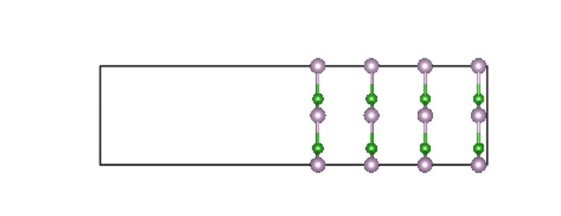
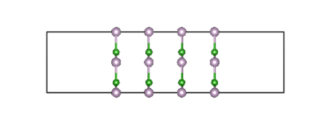
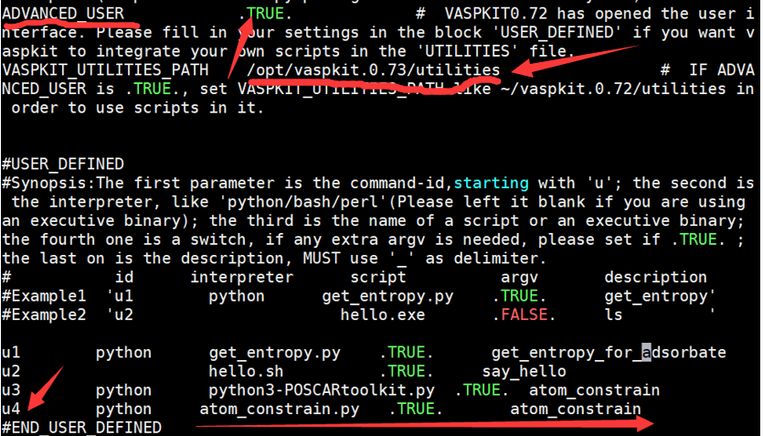
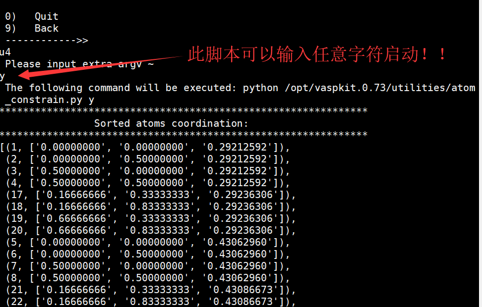

#### 1 Fix_POSCAR(以atom_constrain.py为例)

##### 1.1 atom_constrain.py 使用介绍

 在对`slab` 结构进行计算时，有的时候为了减少计算量，可以考虑把slab 结构中某些层进行固定，目前固定的方法有很多，比如用`MS `进行手动固定，`vaspkit-402` 功能或许楠的`POSCARtoolkit.py `脚本等都可以实现不同方式的原子层固定，但目前`vaspkit-402`功能会把`POSCAR `坐标自动转换为笛卡尔坐标，`POSCARtoolkit.py` 功能虽然比较齐全，但操作比较复杂。因此，本脚本克服了上述问题，可以实现原本的`POSCAR`已经被固定或没被固定的情况，且输出文件不会对原有的`POSCAR` 进行转换。

*脚本主要功能:*  实现两种方式对`POSCAR` 进行选择性固定：

* 方式1：选择固定的总层数，适用于不对称表面的slab 结构，如图：



* 方式2：选择固定任意层数，适用于对称型表面`slab` 结构，如图：

  



下面详细介绍两种方式的使用流程。

**方式1：**

 把`atom_constrian.py` 脚本拷贝到`POSCAR` 所在目录 然后`python atom_constrain.py`

屏幕将输出如下提示：

```bash
**************************************************************
                Sorted atoms coordination:                    
**************************************************************
[(2, ['2.315225840', '0.000000000', '0.000000000']),
 (3, ['0.000000000', '2.315225840', '0.000000000']),
 (7, ['3.472838759', '1.157612920', '1.157612920']),
 (8, ['1.157612920', '3.472838759', '1.157612920']),
 (1, ['0.000000000', '0.000000000', '2.315225840']),
 (4, ['2.315225840', '2.315225840', '2.315225840']),
 (5, ['1.157612920', '1.157612920', '3.472838759']),
 (6, ['3.472838759', '3.472838759', '3.472838759'])]
**************************************************************
 Please input a threshold value according to layer distance,
 the atoms coordination has been listed above.e.g:for direct a
 smaller value as 0.001,for cartesian a bigger value as 0.5 needed
      
**************************************************************

Input:
 1
```
脚本已经把`POSCAR `按照 z 方向坐标进行按层排序，并把所有原子序号及坐标打印到屏幕，由于原本的`POSCAR` 是笛卡尔坐标，所以`z `坐标单位是真实长度，且此时其层间距数值较大，如上面的结果所示，倒数第二层与最后一层间距数值差异达到`1.1A`,这个差值可以作为`Input:` 后面层间距的阈值判断的依据，输入的阈值在（0,1.1）范围内时，比如0.3或0.9、或1.1 等，脚本会自动把`POSCAR` 中两层间的距离大于输入的阈值的原子算作不同的层，比如此例中将会计算出4层，如果输入的阈值为1.2 或更大，由于`POSCAR `没有任何两层间的距离比1.2大，因此整个`POSCAR` 将会被脚本认为只有一层。

本例输入阈值为1,其输出结果如下，提示有4层被找到以及让用户输入方式1 或方式2 ，在这里输入`a`（选择方式1）：`
```bash
​``` bash
**************************************************************
           There are total  4 layers are found!
**************************************************************
**************************************************************
      There are two  methods to fix atoms in POSCAR:

The first one :input a total layer number,e.g. 5 means you will fix 5 layers from bottom to top
The second one:input a layer order number,e.g. 3 4  measn you
 will fix the 3th and 4th layer ,used in case where you want to fix
 center part of the POSCAR 
**************************************************************
**************************************************************

     Please input a for method 1 and b for method 2:
a
**************************************************************
**************************************************************
``````


如上面的输出结果所示，当选择方式1 后，提示输入固定的层数，此处输入3，并输入固定的类型为：`F F F`

```bash
Please input the total number of layers to be fixed :3
**************************************************************
**************************************************************

Please input which type you will fix,e.g. F F T,F F F,T F F etc.:
F F F
**************************************************************
```


最后脚本把被固定的原子的序数打印出来，并把被固定的结果输出到 `POSCAR_NEW` 里面。如下所示：

```bash
**************************************************************
             Atoms number below have been fixed !

[2, 3, 7, 8, 1, 4]
            New POSCAR has been written in POSCAR_NEW !
**************************************************************
**************************************************************
        You may contact 316187631@QQ.com if any questions
**************************************************************
```

**注意:如果 输入a 或 F F F 提示有误，请输入'a' 和' F F F ' 替代！**


**方式2** 

使用方法和方式1基本相同，重新运行脚本，此次我故意选了一个分数坐标的 `POSCAR`

```bash
Zn4 O4
1.0
4.6304516792 0.0000000000 0.0000000000
0.0000000000 4.6304516792 0.0000000000
0.0000000000 0.0000000000 4.6304516792
   Zn    O
    4    4
Selective Dynamics
Cartesian
0.000000000   0.000000000   2.315225840   F F F
2.315225840   0.000000000   0.000000000   F F F
0.000000000   2.315225840   0.000000000   F F F
2.315225840   2.315225840   2.315225840   F F F
1.157612920   1.157612920   3.472838759   T T T
3.472838759   3.472838759   3.472838759   T T T
3.472838759   1.157612920   1.157612920   F F F
1.157612920   3.472838759   1.157612920   F F F
```


```bash
**************************************************************
                Sorted atoms coordination:                    
**************************************************************
[(1, ['0.00000000', '0.00000000', '0.25641708']),
 (2, ['0.00000000', '0.50000000', '0.25641708']),
 (3, ['0.50000000', '0.00000000', '0.25641708']),
 (4, ['0.50000000', '0.50000000', '0.25641708']),
 (21, ['0.16666666', '0.33333333', '0.25682279']),
 (22, ['0.16666666', '0.83333333', '0.25682279']),
 (23, ['0.66666666', '0.33333333', '0.25682279']),
 (24, ['0.66666666', '0.83333333', '0.25682279']),
 (5, ['0.00000000', '0.00000000', '0.37810712']),
 (6, ['0.00000000', '0.50000000', '0.37810712']),
 (7, ['0.50000000', '0.00000000', '0.37810712']),
 (8, ['0.50000000', '0.50000000', '0.37810712']),
 (25, ['0.16666666', '0.33333333', '0.37851282']),
 (26, ['0.16666666', '0.83333333', '0.37851282']),
 (27, ['0.66666666', '0.33333333', '0.37851282']),
 (28, ['0.66666666', '0.83333333', '0.37851282']),
 (9, ['0.00000000', '0.00000000', '0.49979715']),
 (10, ['0.00000000', '0.50000000', '0.49979715']),
 (11, ['0.50000000', '0.00000000', '0.49979715']),
 (12, ['0.50000000', '0.50000000', '0.49979715']),
 (29, ['0.16666666', '0.33333333', '0.50020285']),
 (30, ['0.16666666', '0.83333333', '0.50020285']),
 (31, ['0.66666666', '0.33333333', '0.50020285']),
 (32, ['0.66666666', '0.83333333', '0.50020285']),
 (13, ['0.00000000', '0.00000000', '0.62148718']),
 (14, ['0.00000000', '0.50000000', '0.62148718']),
 (15, ['0.50000000', '0.00000000', '0.62148718']),
 (16, ['0.50000000', '0.50000000', '0.62148718']),
 (33, ['0.16666666', '0.33333333', '0.62189288']),
 (34, ['0.16666666', '0.83333333', '0.62189288']),
 (35, ['0.66666666', '0.33333333', '0.62189288']),
 (36, ['0.66666666', '0.83333333', '0.62189288']),
 (17, ['0.00000000', '0.00000000', '0.74317721']),
 (18, ['0.00000000', '0.50000000', '0.74317721']),
 (19, ['0.50000000', '0.00000000', '0.74317721']),
 (20, ['0.50000000', '0.50000000', '0.74317721']),
 (37, ['0.16666666', '0.33333333', '0.74358292']),
 (38, ['0.16666666', '0.83333333', '0.74358292']),
 (39, ['0.66666666', '0.33333333', '0.74358292']),
 (40, ['0.66666666', '0.83333333', '0.74358292'])]
**************************************************************
 Please input a threshold value according to layer distance,
 the atoms coordination has been listed above.e.g:for direct a
 smaller value as 0.001,for cartesian a bigger value as 0.5 needed
      
**************************************************************
Input:
0.03
```

**注意：由于此时的Z方向数值差异较小，为0.12左右，因此 输入阈值在（0,0.12)之间均可。**

接下来按提示输入：

```bash


**************************************************************
           There are total 5 layers are found!
**************************************************************
**************************************************************
      There are two  methods to fix atoms in POSCAR:

The first one :input a total layer number,e.g. 5 means you will fix 5 layers from bottom to top
The second one:input a layer order number,e.g. 3 4  measn you
 will fix the 3th and 4th layer ,used in case where you want to fix
 center part of the POSCAR 
**************************************************************
**************************************************************

     Please input a for method 1 and b for method 2:
b
**************************************************************
**************************************************************

Please input the number of layer order to be fixed :4 5
**************************************************************
**************************************************************

Please input which type you will fix,e.g. F F T,F F F,T F F etc.:
F F T
**************************************************************
**************************************************************
             Atoms number below have been fixed !

[13, 14, 15, 16, 33, 34, 35, 36, 17, 18, 19, 20, 37, 38, 39, 40]
            New POSCAR has been written in POSCAR_NEW !
**************************************************************
**************************************************************
        You may contact 316187631@QQ.com if any questions
**************************************************************
```
我选择了方式2，输入`b` ，层数输入`4 5`，并输入`F F T` 固定类型，表示 我将要把从底部往上的第一层
和第二层进行相应的固定。输出结果同样把被固定的原子数打印出来。其`POSCAR_NEW`显示如下：

```bash
Super Cell Generated by VASPKIT
0.8
7.99480009 0.00000000 0.00000000
-3.99740005 6.92369998 0.00000000
0.00000000 0.00000000 30.81599998
  P  B
  20  20
Selective Dynamics
Direct
0.00000000   0.00000000   0.25641708   T T T
0.00000000   0.50000000   0.25641708   T T T
0.50000000   0.00000000   0.25641708   T T T
0.50000000   0.50000000   0.25641708   T T T
0.00000000   0.00000000   0.37810712   T T T
0.00000000   0.50000000   0.37810712   T T T
0.50000000   0.00000000   0.37810712   T T T
0.50000000   0.50000000   0.37810712   T T T
0.00000000   0.00000000   0.49979715   T T T
0.00000000   0.50000000   0.49979715   T T T
0.50000000   0.00000000   0.49979715   T T T
0.50000000   0.50000000   0.49979715   T T T
0.00000000   0.00000000   0.62148718   F F T
0.00000000   0.50000000   0.62148718   F F T
0.50000000   0.00000000   0.62148718   F F T
0.50000000   0.50000000   0.62148718   F F T
0.00000000   0.00000000   0.74317721   F F T
0.00000000   0.50000000   0.74317721   F F T
0.50000000   0.00000000   0.74317721   F F T
0.50000000   0.50000000   0.74317721   F F T
0.16666666   0.33333333   0.25682279   T T T
0.16666666   0.83333333   0.25682279   T T T
0.66666666   0.33333333   0.25682279   T T T
0.66666666   0.83333333   0.25682279   T T T
0.16666666   0.33333333   0.37851282   T T T
0.16666666   0.83333333   0.37851282   T T T
0.66666666   0.33333333   0.37851282   T T T
0.66666666   0.83333333   0.37851282   T T T
0.16666666   0.33333333   0.50020285   T T T
0.16666666   0.83333333   0.50020285   T T T
0.66666666   0.33333333   0.50020285   T T T
0.66666666   0.83333333   0.50020285   T T T
0.16666666   0.33333333   0.62189288   F F T
0.16666666   0.83333333   0.62189288   F F T
0.66666666   0.33333333   0.62189288   F F T
0.66666666   0.83333333   0.62189288   F F T
0.16666666   0.33333333   0.74358292   F F T
0.16666666   0.83333333   0.74358292   F F T
0.66666666   0.33333333   0.74358292   F F T
0.66666666   0.83333333   0.74358292   F F T
```


##### 1.2 把`atom_constrain.py` 加入`vaspkit` 统一管理

`Vaspkit` 目前功能越来越完善，如果用户自己有些小的脚本可以补充`vaspkit `的功能，那么，可以把自己的小脚本“集成到”`vaspkit`里面，用`vaspkit `统一管理自己的脚本，现在以`atom_constrain.py `为例讲解如何把该脚本“放到”`vaspkit` 里面，利用`vaspkit` 惯有的工作模式进行使用：

第一步：进入`vaspkit `安装目录下的`utilities` 目录，我安装`vaspkit`的路径如下 ：

```bash
/public/home/vaspkit.0.73/utilities
```

第二步：把`atom_constrain.py` 拷贝到此

第三步：`vim ~/.vaspkit ` （或`vi~/.vaspkit`）

按图下修改：注意图中箭头处

 

输入“`:wq`” ,保存并退出

第四步，进入含有`POSCAR` 的目录体验一把：

输入`vaspkit`--->>74得到如下图示：


接着输入`u4` ,再输入任何字符回车后进入脚本工作页面：




